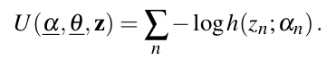
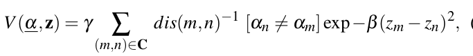
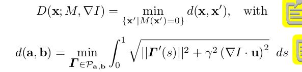
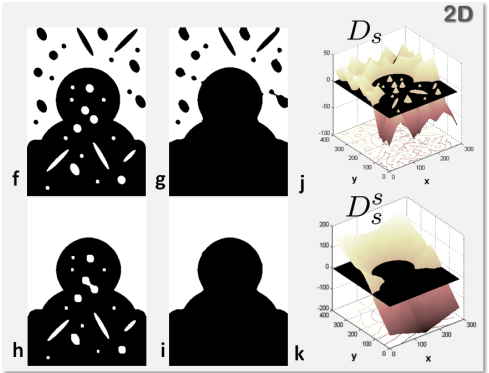
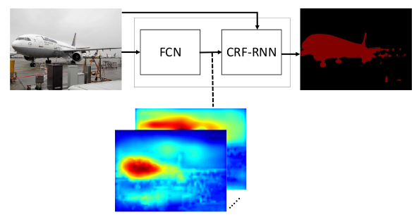

# Interactive Segmentation

# GrabCut (2004) - Extension of GraphCut (2001)
-	Graph-Cut = Texture (colour) + Edge (contrast) information for foreground-background segmentation
-	Graph Cut
	-	Formulated as an energy minimization, which should correspond to a good segmentation
	-	Unary term: 
		-	Entropy of fore- and background greyscale values (histograms)
		-	
		-	Encourages non-uniformity of the gray scale values assigned to the alphas {0, 1}
	-	Binary term (smoothness term):
		-	High energy if ---> pixels are different class + similar intensity + in close proximity
		-	
	-	Graph Cut encourages coherence in regions of similar grey-levels.
		-	No need to define it as a fully-connected graph - look only at 8-neighbors (direct neighbors)
	-	Energy function can be optimized w.r.t. alphas, using standard minimum cut algorithm (GraphCut 2001)

-	GrabCut 
	-	Works with color data
	-	Replaces the histograms of grey values with **GMMs**
	-	One-shot minimum cut is replaced with an **iterative procedure** to update the GMM parameters, but also use Min-Cut/Max-Flow to estimate the segmentation in each iteration
	-	Only requires a **bounding-box** input interaction (or lasso)

# GeoS (2007) - Predecessor of DeepIGeoS

## Motivation
-	Previous work (GraphCut (2001) and GrabCut (2004)) are computationally expensive and cannot be applied to high resolution images
-	Geodesic distance resticts the possible space of solutions -> it leads to a better search efficiency
-	Segmentation posterior is also found ---> uncertainty analysis
-	Algorithm can be sped up even further through parallelisation (which was not feasible with graph cuts as easily)
	-	Based on the raster scan from Toivanen (O(N)) (1998(

## Method
-	Approximate energy minimization in a conditional random field
-	Used for **binary segmentation**
-	Parallel fitlering operator for efficient geodesic distance computation
	-	Proposes spatially smooth, contrast-sensitive segmentations
-	Lowest energy solution is found in linear time
	-	With both Toivanen (Raster Scan) and Yatziv (Fast Marching Methods - FMM) algorithms
		-	However, Yatziv's algorithms employs FMM, which accesses the image lacations far from each other in memory
		-	Toivanen's technique accesses the image in contiguous blocks
-	The geodesic filter acts on the energy unaries in the CRF
	-	Large jumps in the geodesic distance correspond to stronger edges (due to the image gradient in the distance computation)
	-	
-	Based on geodesic distance - dilation, erosion, closing and opening can be defined 
	-	Theta parameters can be set to filter foreground and background noise speckles and should be set to the maximum size of those
	-	Theta parameters, hence, regulate the **spatial smoothness** 
			- 	larger theta yield smoother segmentation boundaries
			- 	Smaller thetas are "locked" by the brightness structures
-	
-	Energy function can be formulated w.r.t. thetas - as they regulate the smoothness, they also regulate the energy
	-	Weak unaries (high uncertainty of the classifier) lead to vastly different results when thetas are altered
-	Search space for the theta parameters can be traversed linearly and in parallel

# Active Learning (2011) 

## Method
-	Evaluate a given segmentation by constructing an uncertainty field over the image
	-	Based on: boundary, regional, smoothnes and entropy terms
	-	The method highlights the plane of maximal uncertainty
	-	User can guide the labeling of the data providing additional training data where the classifier has the least confidence
	-	Compared to random region selection --> 64% faster convergence (good segmentation results)
-	Active Learning Definition
	-	Supervised machine learning, where instead of the user, a component of the algorithm called the **query strategy** is responsible for choosin the training data to be labeled.
	-	Using active learning makes the training more efficient (faster convergence)
-	Probabilistic algorithms are preferred to energy minimizing as they implicitly encode uncertainty (e.g. softmax predictions)
-	Only works for **binary segmentation**
-	Query strategies
	-	Uncertainty sampling
	-	Low confidence (same as above?)

# CRF-RNN (2015)

## Motivation 
-	Deep learning techniques alone have a limited capacity to delineate visual objects (exact position and border in the image)
-	It is important to explicitly consider factors such as image edges, appearance consistency, and spatial consistency
	-	Solution: Combine deep learning with CRF
-	Traditional CNNs have large receptive fields + max-pooling -> they obtain a coarse boundaries and blob-like shapes
-	CNNs also lack **smoothness contraints**, which can result in poor object delineation and small spurious regions
-	However, CRFs are able to refine weak and coarse pixel-level label predictions to produce **sharp** boundaries and fine-grained segmentation

**Note**: This paper has a very simple and precise explanation of the CRF mean-field approximation algorithm.

## Related Work
-	Previous work (DeepLab) uses CRF simply as a post-processing step to a CNN output
	-	Con: CNN cannot adjust its weight to the CRF (no updates, no knowledge transfer)

## Method
-	Formulate CRF with Gaussian pairwise potentials and mean-field approximation as RNNs
	-	RNN refines output of CNN and also passes back the differentials back during training
-	Unary potentials are the **inverse likelihoods** of a pixel belonging to a label
-	Q_i(l) is initialized as the softmax probability of pixel i to belong to label l
-	**Message passing** is done by applying 2 Gaussian kernels, 1 Spatial and 1 Bilateral kernels
-	**Weighted Filter Outputs** is done by a 1x1 convolution with M input channels (M = #Labels) and 1 output channel
-	**Compatibility Transform** is also a 1x1 convolution with in- and output channels = L. This learns the compatibility function which is more flexible than the Potts model with fixed penalty
-	Formulation as RNN
	-	Each iteration is simply a stack of CNN layers. 
	-	The original unary values from the segmentation model are fixed for all iterations
	-	The output Q values are used as an input to the next Q values estimation
	-	Around 10 iterations are enough for convergence (no vanishing or exploding gradients)
		-	Vanilla RNN is enough, as opposed to LSTM
		-	RNN timesteps correspond to the iterations from the classical algrotithm - 10 are enough
-	Con: Not all parameters are trainbable due to the permutohedral lattice implementation
	-	e.g. Gaussian, Spatial, and Bilateral filter parameters
-	

# Interactive Segmentation - ScribbleSup (2016) 

## Method
-	Train CNN for semantic segmentation using scribbles as annotations
	-	In this paper a FCN 
-	Propose a graphical model which propagates scribble information to unmarked pixels 
	-	Using spatial, appearance and semantic constraints
-	In general - how to train a CNN not with pixel-wise labels, but with scribbles
	-	Easier and faster to annotate datasets this way
	-	Especially for ambiguous objects, sucha as water, sky, grass etc.
	-	Inspired by interactive segmentation with scribbles
-	Algorithm can be considered a weakly-supervised learning
-	To propagate the scribble labels to the whole image they employ CRFs over **superpixels**
-	The unary term are defined from the scribbles and the output of the FCN
	-	Scribbles:
		-	Zero cost to assign the label of the scribble if the pixel is part of a scribble
		-	Infinite cost to assign a scribble pixel to another label
		-	Uniform cost for all other labels, but only consider labels from the scribbles (subset of all classes) -> reduces the false positives
	-	FCN:
		-	Just the negative log likelihood of the FCN outputs
-	Pairwise potential
	-	Only for adjacent super-pixels
	-	This time, the potential uses the color and edge histogram distances (similar to GrabCut (2004)
-	Optimization has two variables - Y (labels) and FCN-parameters
	-	Fix theta -> solve for Y ---> Simple graph cut solution
	-	Then vice versa and repeat ---> Simple backpropagation

# Interactive Segmentation - Deep Interactive Object Selection (2016) - first deep learning method for interactive object segmentation

## Related Work
-	Authors list GraphCut, GrabCut, Weighted Geodesic Distances, Random Walk as alternative approaches
	-	Cons: All these require substantial user interactions to have a good estimation of the Fg, Bg distributions
	-	Authors claim their method is able to achieve this with a few clicks (even 2 are enough)
	-	They also claim that deep learning models can understand **objectness** and **semantics** better than classical approaches
	-	Authors claim this is the **first interactive object segmentation with deep learning**
-	Why deep learning?
	-	Classical approaches estimate the Fg, Bg distributions from low-level features
		-	Insufficient at distinguishing the Fg, Bg, when similar foreground and background appearances, complex textures, and bad lighting conditions'
			-	In these cases, the classical algorithms require extensive user interactions
		-	In contrast an FCN can learn **objectness** and **semantics**
			-	Which simplifies the interaction to a few clicks

## Method
-	Click-based interaction (positive and negative clicks)
-	Clicks are used to generate Euclidean Distance Maps, which are concatenated to the RGB images
-	For training, clicks are simulated
-	Segmentation model is based on FCN
-	Graph cut optimization is used to refine the output of the FCN
	-	Based on the probability maps from the FCN
-	Task is **binary segmentation**
-	Click = Foreground or Background
-	Euclidean Distance Maps are calculate the same way as with the Geodesic Distance Transform
	-	The pixel corresponds to the minimum Euclidean Distance to the Set of Mouse Clicks
-	Positive Click samples are generated by sampling the GT Pixels but:
	-	Only sample pixels which are at least d_step away from each other
	-	Only sample pixles which are at leats d_margin away from the boundary
-	Negative pixels are sampled from the complement of the GT pixels but at least a **d** distance away from the boundary
	-	Three sampling strategies are employed to simulate a user annotation
		-	n negative clicks randomly sampled from whole Bg space (again with d_step and d_margin)
		-	m negative clicks are sampled from negative objects (again with d_step and d_margin)
		-	p negative clicks to sample as close as possible to the positive object's boundary (+ some margin)
-	CRF is modelled as follows:
	-	Unary terms correspond to the cross-entropy loss
	-	Binary terms are the intensity difference / euclidean distance (no additional smoothness term)
-	Inference with User Interactions:
	-	User clicks and euclidean maps are calculated on the fly
	-	FCN produces probability map, which is solved by Graph Cut for the segmentation

## Experiments
-	Results show a clear improvement of the classical approaches
-	A comparison to FCN and CRF-RNN shows that interaction leads a better refinement
	-	The interactive method also allows **instance segmentation** when multiple intances of the same object are present
	-	Interactive method segments unseen classes (zero-shot learning) and generalizes better

# Interactive Segmentation - DeepLab (2016) - First CNN scores + CRF method (non-interactive)

## Motivation
-	Responses at the final layer of DCNNs are not sufficiently localized for accurate object segmentation.
	-	Caused by the invariance properties, which make DCNNs good for high-level tasks.
-	CNNs have a built-in invariance to local image transformations, which underpins their ability to learn hierarchical abstractions of data (Zeiler/Fergus 2014)
-	However, in semantic segmentation, we want precise localization and are dependent on low-level features
	-	Rather than abstraction of spatial details
-	Challenges for DCNNs for semantic segmentation
	-	Reduced feature resolution
	-	Existence of objects at multiple scales
	-	Reduced localization accuracy due to DCNN invariance

## Method
-	They show how to combine DCNNs with CRFs - cascade of two fairly well-established methods
-	They propose using **atrous convolutions** (dilated convs) to capture features in different scales
	-	Upsampling of the feature maps in last layers instead of max pooling
	-	Powerful alternative to the deconvolutional layers
	-	Larger field of view of filters without increasing the parameters
-	They propose an atrous spatial pyramid to segment objects at different scales
	-	Multiple parallel atrous convolutional layers with different sampling rates
		-	Parallel branches share their parameters
-	Pooling and Upsampling leads to the **checkerboard** pattern
	-	Atrous convolutions leads to a smoother output
-	Unary CRF potentials are set to negative-log-likelihoods of the DCNN predictions
-	For the binary potentials
	-	Potts model for the compatibility function
	-	Bilateral and Spatial filter for the pairwise potentials
-	Training
	-	DCNN is trained first and fixed when training the CRF
	-	DCNN unary terms are fixed during training of CRF
		-	CRF "training" via mean-field-approximation iterations  
		-	Hyperparameters are found by cross-validation on 100 images with a coarse-to-fine search

# Interactive Segmentation - DeepCut (2017) - Extension of GrabCut (2004)

## Method
-	Train NN from bounding box annotations
-	Problem formulated as an energy minimization problem over a densely-connected CRF
-	Advantage of using bounding boxes vs. scribbles/pixels
	-	Allows to spatially contrain the problem
-	Why not use a classical approach (e.g. GrabCut)?
	-	We can assume that objects share common shape and appearance information which can be learned
	-	Instead of direct image-by-image object segmentation - re-use the learned features
	-	Particularly interesting for medical images, where an entire dataset is to be analysed for a specific organ or region
		-	Large class similarity in terms of shape and appearance
-	This paper has a good explanation of the history of improvements of GrabCut
-	CNN + CRF is used to obtain the final segmentations
-	NLL of the output probabiities constitute the unary term
-	Binary term is simply taken from the Krähenbühl paper
-	CNN in this paper is trained on **binary segmentation**
-	Actually no interaction with the user??

# Interactive Segmentation - DeepIGeoS (2017)

## Method
-	CNN model **p**roposes segmentation (P-Net)
-	User adds **corrections**  to proposal and feeds both to R-Net (+ original image), which outputs the refined segmentation
		-	Combination through geodesic distance transforms 
-	Scribbles labels the pixes as background and foreground (binary segmentation)
-	The geodesic distance helps to better differentiate neighboring pixels with different appearances, and improves label consistency in homogeneous regions.
-	Model runs in real-time and reduces number of user interactions, due to the already good features produced by the P- and R-Net
-	Given an image the Geodesic Distance Transform computes the distance map with the same resolution
	-	Requires a scribble to separate forground from background
	-	Image + Initial Segmentation + Distance Maps for fore- and background are stacked and fed to the R-Net
-	Resolution preservation through dilated convolutions instead of max-pooling in the P- and R-Net
	-	Different dilation help capture features in different scales
-	Each block has a fixed output channel size C
	-	Features from all blocks are forward-propagated and concatenated to have a combine feature vector with different scales (length 5*C)
-	CRF-Net is applied to the output of the CNNs (probabilities of each pixel belonging to background or foreground)
	-	CRF Net is extension of the CRF-RNN model
	-	User refinement context is also integrated to the output of R-Net
-	Unary potential is set to the **(inverse)** outputs of P- and R-Net
-	Sum of weighted Gaussians is substituted by a FCN (Pairwise-Net), (typically: Pairwise potential = compatibility * weighted kernels)
-	The fully-connected CRF cannot be computed for all pixel pairs, when the pairwise potentials are not weighted Gaussians
	-	DeepIGeoS uses patches with centers instead 
-	Cons: Requires 100k training samples for the **PairWise-Net**

# Interactive Segmentation - Guide Me (2018)

## Method
-	Guide a visual-learning CNN with user text input **online** *(also mouse clicks)*
	-	Add a layer that acts as a spatio-semantic guide into the network
		-	Either as a energy minimization scheme
		-	Or a recurrent model which translates human language queries to interaction weights
-	Language-based corrections instead of scribbles
-	The authors claim that online learning is important in medical image analysis, where the experience of trained practitioners matters and segmentation models are not always robust
	-	Another relevant example is speeding up labor-intensive and repetitive labeling tasks, such as creating datasets for semantic segmentation
-	Interactions update the network at **test time**
-	Closely related to VQA
	-	Question posed as text
	-	Answer is based on the image context
	-	However, this method does not output a textual answer (caption, answer), but an **image**
-	The approach can be applied to any **fixed CNN** - CNN-model agnostic
-	The authors also propose how to guide the CNN with **clicks**
-	Guiding block adjusts activation maps of the CNN
	-	Guiding vector multiplies each channel of the CNN bottleneck feature tensor
	-	And two separate guiding vectors for the width and height
## Training procedure
-	Pre-trained semantic segmentation model (e.g. FCN) outputs prediction
-	Hint generator takes prediction + GT and generates a hint
	-	Hint consists of **class** + **location**, e.g. cat is missing on the right
-	The Guide (GRU-cell) takes the textual input and produces alpha, beta, and gamma to modulate the segmentation network
-	The segmentation model then adjusts its prediction and a pixel-wise cross entropy is applied
-	The guide learns to process textual cues, which **improve** the segmentation results
-	The hint generator is a form of **simulation of textual input**, which can be real-user input during test time

## Alternative training
-	Guide can be just the alpha, beta, and gamma vectors (not a network)
-	Parameters can be estimated by applying the loss only to masked regions 
	-	Mask corresponds to pixels which are pointed by the hint
	-	A masks could be generated by labeling pixels with a mouse during inference
-	For training, to simulate mouse clicks:
	-	Only the pixel with the smallest posterior probability difference between the two most confident classes is taken, since it has the highest interclass uncertainty.
	-	This is repeated for multiple pixels (0, 1, 5, 10, 15, 20) (which make up the mask)

# Interactive Segmentation - BIFSeg (2018) ---> extension of DeepIGeoS to work on unseen objects

## Related Work
-	They list DeepCut, DeepIGeoS, Deep Interactive Object Selection
	-	One challenge when using CNNs is the requirement of large amounts of annotated images for training
	-	CNNs also do not generalize well to unseen objects
	-	Authors discourage using DeepMedic or HighRes3DNet as they have a high memory requirement
	-	DeepIGeoS 
		-	Good interactivity
		-	Lack of adaptability to uneen image contexts
## Method
-	Bounding box to extract foreground from background
-	Image-specific fine-tuning on **test** data
	-	Either with or without the user interactions (scribbles)
-	Low memory requirements for fast inference
-	Con: Only binary segmentation
-	Training:
	-	GT bbox is used to crop the target objects and a network is trained on **binary segmentation**
		-	Training on multiple different organs ---> not organ specific!
		-	This way the CNN learns common features
			-	Saliency, contrast, hyperintensity across different objects, which helps to generalize to unseen objects
	-	Training dataset with multiple labels is converted to a binary classification dataset (with more sample as there could be multiple object instances in one image)
	-	Training dataset is also pre-processed to only have cropped regions (+- 10 pixels / voxels margin)

-	Testing:
	-	User provides bounding box to crop a region
	-	CNN outputs initial segmentation
		-	User can additionally provide a scribble to correct
			-	Scribbles can correspond to fore- or background for a correction
			-	Loss function applied to scribbles is similar to GrabCut (2004, GMMs)
				-	Solved in two steps:
					-	First fix network parameters and update the label -> Results in a CRF solved by Graph Cuts 
					-	Then fix label and update weights --> simple CE-Loss
				-	Weight in CE-Loss is larger for scribbles, since they should have a higher impact (higher update)
		-	CNN updates its weights on a single image and refines the result at the same time
			-	Update only on the final classification layers (block 6)
	-	CNN can be applied to unseen objects! **(zero-shot learning)**
-	Architecture
	-	They use the proposed P-Net model from DeepIGeoS

# Interactive Segmentation - CRF (2021)

## Goal
-	Convert image segmentation into a graph optimization using Fully-Connected Conditional Random Field

## Related work
-	Recommends which slice to annotate next (similar to active learning)
-	No need for parameter tuning for each application (imaging type + objects of interest)

-	Manual annotation tools
	-	Line tracing
	-	Polynomial curve fitting
	-	Area painting
	-	ITK-Snap
	-	3D-Slicer

-	Semi-automatic
	-	Allow user interaction to improve labels
	-	Iterative improvement by adding scribbles - grow cuts and graph cuts

-	Types of user annotation
	-	Point-based
	-	Contour-based
	-	**Scribble-based**
	-	Bbox-based

-	Comment on CNN approaches
	-	The main drawback of these DCNN-based methods is the requirement of a training process using either weakly or fully labeled data.

## Method
-	Problem is formulated as Maximum A-Posteriori (MAP) inference in a CRF
-	Each class has its own energy function - the energy must be minimized to solve which pixel is assinged to a certain class
-	The pairwise energy is lower for pixels which are 
	-	Similar in appearance
	-	Closer to each other (smoothness)
-	The unary **class** energy is lower for pixels which are:
	-	Similar in appearance to mean class intensity
	-	Closer to the nearest annotated pixel of the class (using geodesic distance)
-	Uncertainty of slice through entropy 
-	Annotation is propagated to 3D volumes trought the labels of few slices (smoothness term)
-	Pro: 
	-	Does not require accurate contour tracing which needs lower concentration levels from the annotator
-	Cons:
	-	Not particulary suitable for blood vessel segmentation
	-	Or any long and thin linear structures

		

