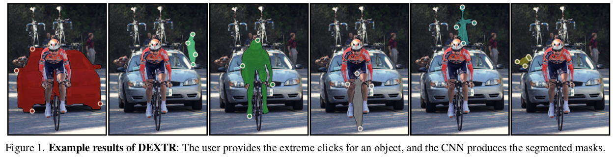
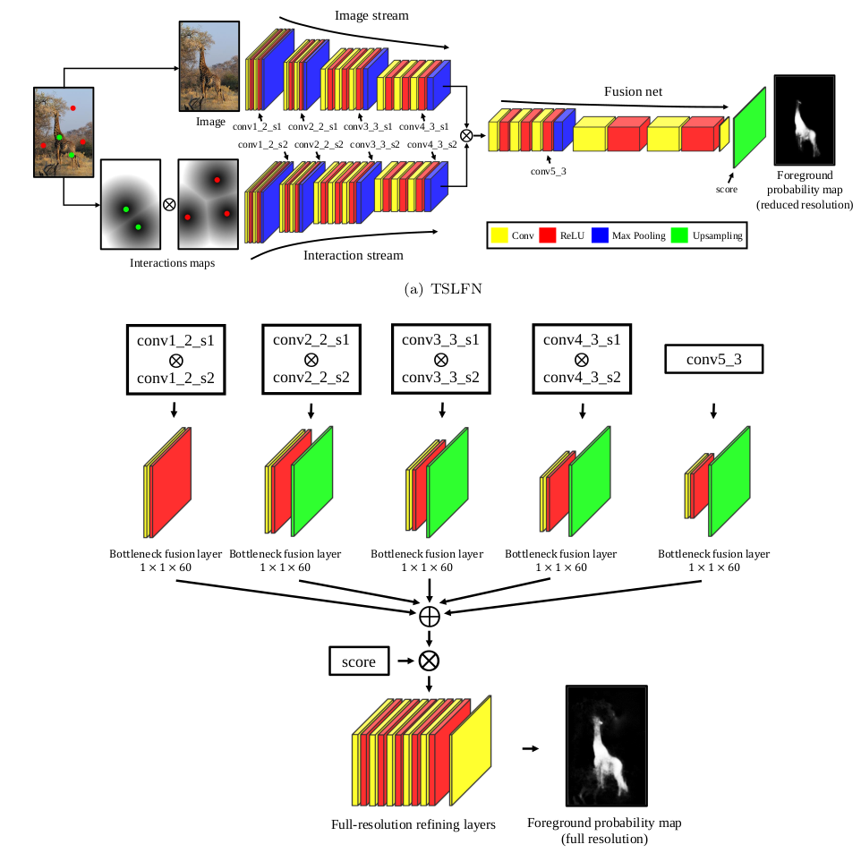
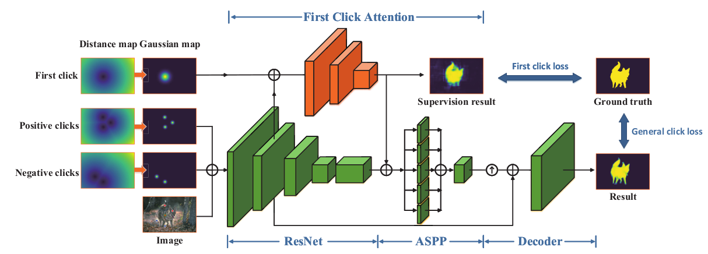

# Interactive Segmentation

# GraphCut (2001) - seminal paper

## Related Work
-	Snakes, deformable templates, shortest path, ratio regions only work on 2D images
	-	Intelligent scissors and Live wire need very precise user interactions
-	Region growing, split and merge methods do not have cost functions
	-	Since the properties of what a "boundary" is are not optimized - leaking in blurry boundaries can be observed
-	Only an approximate solution - region competition, level set methods, normalized cuts
-	

## Method
-	Binary segmentation (Foreground-Background)
-	Hard constraints added by user
	-	Indicated Pixels = Seeds
-	Soft constraints regarding boundary and region properties
	-	Solution is find by min-cut/max-flow algorithm
-	Method can be applied to 3D images as well
-	Assume some pixels are marked as internal, and some as external to the object
-	
-	The boundary term defines the neighbouring edge weights
-	The regional terms defines the weight of the edges to the sink/source terminals
-	Regional terms (unary) is the negative log-likelihood, given the histogram of scribbles
-	Boundary terms (binary) are the pixel-intensity + spatial distance Gaussian Kernel
	-	Penalty when pixel intensity of neighbours with different labels is smaller than sigma

# GrabCut (2004) - Extension of GraphCut (2001)
-	Graph-Cut = Texture (colour) + Edge (contrast) information for foreground-background segmentation
-	Graph Cut
	-	Formulated as an energy minimization, which should correspond to a good segmentation
	-	Unary term: 
		-	Entropy of fore- and background greyscale values (histograms)
		-	
		-	Encourages non-uniformity of the gray scale values assigned to the alphas {0, 1}
	-	Binary term (smoothness term):
		-	High energy if ---> pixels are different class + similar intensity + in close proximity
		-	
	-	Graph Cut encourages coherence in regions of similar grey-levels.
		-	No need to define it as a fully-connected graph - look only at 8-neighbors (direct neighbors)
	-	Energy function can be optimized w.r.t. alphas, using standard minimum cut algorithm (GraphCut 2001)

-	GrabCut 
	-	Works with color data
	-	Replaces the histograms of grey values with **GMMs**
	-	One-shot minimum cut is replaced with an **iterative procedure** to update the GMM parameters, but also use Min-Cut/Max-Flow to estimate the segmentation in each iteration
	-	Only requires a **bounding-box** input interaction (or lasso)

# Lazy Snapping (2005)

## Related Work
-	They list related work as boundary- and region-based
	-	Boundary - cut out the foreground by user input surrounding curve which evolves iteratively
		-	Cons: Requires concentration and is error-prone
	-	Region 
		-	Cons: Low-contrast regions and shadows require more user-inputs

## Method
-	Uses scribbles!
-	Combines graph cut with pre-computed over-segmentation
-	Two steps:
	-	Quick object marking step
		-	Additionally + over-segmentation
	-	Simple boundary editing step
		-	Image cutout is formulated as a graph cut in both steps
-	Unary terms are computed using K-means clustering of the foreground and background scribbles
	-	Pixels with a high minimum distance to the foreground clusters are given a high energy when assigned x=1 
-	
-	Pairwise term just compares the colour distance of adjacent pixels 
	-	High penalty when similar adjacent nodes are assigned different labels
-	To improve efficiency - the watershed (1991) algorithm is used as a **pre-segmentation**
	-	Watershed locates boundaries well and preserves small differences inside each small region
	-	Instead of using pixels as nodes, use watershed regions
	-	Color is aggregated as the mean color for all pixels in the regions for the unary term

# GrowCut (2005)

## Related Work
-	Region Growing algorithms might have a problem with leaking out of the object
	-	They also only work for binary segmentation
-	Graph-Cut based are not easily extended to multi-label tasks
	-	They are also not really flexible/tunable - only the graph weighting and cost function coefficients could be altered
-	Authors claim that random walker is the best performing method for medical segmentation
	-	Alongside graph cut, but random walker works with multi-label setups

## Method
-	
-	Multi-label segmentation
-	Scribble-based 
-	Uses Cellular Automation
	-	Iterative process, user can guide the algorithm **during** the segmentation
-	Pixel labeling acts as a process of growth of K-types of bacteria
	-	Bacteria start to spread from the seed pixels and try to occupy all the image
	-	If the difference in color is small and the attacking cell's strength is large enough, the attacked cell takes the same label and strength of the attacking cell
-	The smoothness of the boundary can be achieved by prohibiting a cell to attack if there are too many different labels to it
-	A user can add a brush stroke at any time during the automata evolution process
	-	This changes the states in the cell automata
-	The brush strokes can also consider the maginitude of the certainty
	-	"This region is "maybe" foreground"
	-	This makes the process more tolerable to inaccurate paint strokes
		-	E.g. boundaries of objects like flowers or plant leaves
-	Initial strength of the cells is set by the user's certainty of the brush strokes

## Results
-	Comparison to Graph Cuts, Grab Cut and Random Walker

# GeoS (2007) - Predecessor of DeepIGeoS

## Motivation
-	Previous work (GraphCut (2001) and GrabCut (2004)) are computationally expensive and cannot be applied to high resolution images
-	Geodesic distance resticts the possible space of solutions -> it leads to a better search efficiency
-	Segmentation posterior is also found ---> uncertainty analysis
-	Algorithm can be sped up even further through parallelisation (which was not feasible with graph cuts as easily)
	-	Based on the raster scan from Toivanen (O(N)) (1998(

## Method
-	Approximate energy minimization in a conditional random field
-	Used for **binary segmentation**
-	Parallel fitlering operator for efficient geodesic distance computation
	-	Proposes spatially smooth, contrast-sensitive segmentations
-	Lowest energy solution is found in linear time
	-	With both Toivanen (Raster Scan) and Yatziv (Fast Marching Methods - FMM) algorithms
		-	However, Yatziv's algorithms employs FMM, which accesses the image lacations far from each other in memory
		-	Toivanen's technique accesses the image in contiguous blocks
-	The geodesic filter acts on the energy unaries in the CRF
	-	Large jumps in the geodesic distance correspond to stronger edges (due to the image gradient in the distance computation)
	-	
-	Based on geodesic distance - dilation, erosion, closing and opening can be defined 
	-	Theta parameters can be set to filter foreground and background noise speckles and should be set to the maximum size of those
	-	Theta parameters, hence, regulate the **spatial smoothness** 
			- 	larger theta yield smoother segmentation boundaries
			- 	Smaller thetas are "locked" by the brightness structures
-	
-	Energy function can be formulated w.r.t. thetas - as they regulate the smoothness, they also regulate the energy
	-	Weak unaries (high uncertainty of the classifier) lead to vastly different results when thetas are altered
-	Search space for the theta parameters can be traversed linearly and in parallel

# Geodesic Star Convexity (2010) - extends star-shape prior + GC 

## Motivation
-	Shape constraints helps to remove disconnected FG islands and also to connect up FG islands into a single component
-	Shape constraints restrict the space of possible segmentations
-	Shapes are usually represented as some kind of distance transform from a template

## Method
-	Multiple starts with Geodesic paths
	-	Authors introduce geodesic forests
-	Star convexity
	-	A shape is star convex w.r.t. to a center c if all points on the shape can be connected with a line to c without multiple crossings of the shape with itself 
-	
-	Con: Not all real-world objects are star-convex, i.e. a cat's tail would hinder this
-	Multiple stars
	-	Make sure each point is visible to the **nearest center point**
	-	Multiple centers ---> multiple stars
-	Using geodesic distance
	-	For all pixels in the image, the shortest path connecting each point to the start centers creates a **geodesic forest**
-	The user brush strokes can be used as star-centers
-	Energy optimization solved globally through graph cut (problem is submodular)
-	Evaluation through robot user

# Active Learning (2011) 

## Method
-	Evaluate a given segmentation by constructing an uncertainty field over the image
	-	Based on: boundary, regional, smoothnes and entropy terms
	-	The method highlights the plane of maximal uncertainty
	-	User can guide the labeling of the data providing additional training data where the classifier has the least confidence
	-	Compared to random region selection --> 64% faster convergence (good segmentation results)
-	Active Learning Definition
	-	Supervised machine learning, where instead of the user, a component of the algorithm called the **query strategy** is responsible for choosin the training data to be labeled.
	-	Using active learning makes the training more efficient (faster convergence)
-	Probabilistic algorithms are preferred to energy minimizing as they implicitly encode uncertainty (e.g. softmax predictions)
-	Only works for **binary segmentation**
-	Query strategies
	-	Uncertainty sampling
	-	Low confidence (same as above?)

		-	

# CRF-RNN (2015)

## Motivation 
-	Deep learning techniques alone have a limited capacity to delineate visual objects (exact position and border in the image)
-	It is important to explicitly consider factors such as image edges, appearance consistency, and spatial consistency
	-	Solution: Combine deep learning with CRF
-	Traditional CNNs have large receptive fields + max-pooling -> they obtain a coarse boundaries and blob-like shapes
-	CNNs also lack **smoothness contraints**, which can result in poor object delineation and small spurious regions
-	However, CRFs are able to refine weak and coarse pixel-level label predictions to produce **sharp** boundaries and fine-grained segmentation

**Note**: This paper has a very simple and precise explanation of the CRF mean-field approximation algorithm.

## Related Work
-	Previous work (DeepLab) uses CRF simply as a post-processing step to a CNN output
	-	Con: CNN cannot adjust its weight to the CRF (no updates, no knowledge transfer)

## Method
-	Formulate CRF with Gaussian pairwise potentials and mean-field approximation as RNNs
	-	RNN refines output of CNN and also passes back the differentials back during training
-	Unary potentials are the **inverse likelihoods** of a pixel belonging to a label
-	Q_i(l) is initialized as the softmax probability of pixel i to belong to label l
-	**Message passing** is done by applying 2 Gaussian kernels, 1 Spatial and 1 Bilateral kernels
-	**Weighted Filter Outputs** is done by a 1x1 convolution with M input channels (M = #Labels) and 1 output channel
-	**Compatibility Transform** is also a 1x1 convolution with in- and output channels = L. This learns the compatibility function which is more flexible than the Potts model with fixed penalty
-	Formulation as RNN
	-	Each iteration is simply a stack of CNN layers. 
	-	The original unary values from the segmentation model are fixed for all iterations
	-	The output Q values are used as an input to the next Q values estimation
	-	Around 10 iterations are enough for convergence (no vanishing or exploding gradients)
		-	Vanilla RNN is enough, as opposed to LSTM
		-	RNN timesteps correspond to the iterations from the classical algrotithm - 10 are enough
-	Con: Not all parameters are trainbable due to the permutohedral lattice implementation
	-	e.g. Gaussian, Spatial, and Bilateral filter parameters
-	

# SlicSeg (2015)

## Related work
-	Single Shot Fast Spin Echo (SSFSE) allows motion artefacts to be absent in the slices 
	-	However, an inhomogenous appearance between slices can occur, caused by the interleaved spatial order of the slices
-	Authors list Active Contours, Graph Cuts, Geodesic Frameworks (GeoS), Random Walks, GrowCut
	-	Most of these methods rely on low-dimensional features and need a large number of user interactions to deal with images with low contrast and weak boundaries

## Method
-	Placenta Segmentation
	-	Challenges are:
		-	Sparse acquisition
		-	Inter-slice motion
		-	Inter-Subject Variance in position and shape of the placenta
-	Random Forests with high-level features
	-	Combination of Online Random Forests and CRFs and a user interaction for **only one slice**
	-	ORF are trained on data coming from scribbles from the user in one slice
	-	Slice-by-slice propagation
-	Binary segmentation
-	CRF uses the prediction probabilities of the ORF and generates new segmentations (used to self-train the ORF)
-	First slice is used to train the initial RF
	-	CRF outputs the label for it
	-	Then the background and foreground are eroded using a filter of size 10 pixels and are fed to train the ORF
	-	The ORFs are trained by minimizing the entropy and each tree is trained on a random number of new samples 
	-	The CRFs are used every time to obtain pseudo-labels
-	
-	

## Result
-	Higher accuracy than sota interactive segmentation methods
	-	Compare segmentations using the same initial scribbles

# ScribbleSup (2016) 

## Method
-	Train CNN for semantic segmentation using scribbles as annotations
	-	In this paper a FCN 
-	Propose a graphical model which propagates scribble information to unmarked pixels 
	-	Using spatial, appearance and semantic constraints
-	In general - how to train a CNN not with pixel-wise labels, but with scribbles
	-	Easier and faster to annotate datasets this way
	-	Especially for ambiguous objects, sucha as water, sky, grass etc.
	-	Inspired by interactive segmentation with scribbles
-	Algorithm can be considered a weakly-supervised learning
-	To propagate the scribble labels to the whole image they employ CRFs over **superpixels**
-	The unary term are defined from the scribbles and the output of the FCN
	-	Scribbles:
		-	Zero cost to assign the label of the scribble if the pixel is part of a scribble
		-	Infinite cost to assign a scribble pixel to another label
		-	Uniform cost for all other labels, but only consider labels from the scribbles (subset of all classes) -> reduces the false positives
	-	FCN:
		-	Just the negative log likelihood of the FCN outputs
-	Pairwise potential
	-	Only for adjacent super-pixels
	-	This time, the potential uses the color and edge histogram distances (similar to GrabCut (2004))
-	Optimization has two variables - Y (labels) and FCN-parameters
	-	Fix theta -> solve for Y ---> Simple graph cut solution
	-	Then vice versa and repeat ---> Simple backpropagation
-	

# ITK-Snap (2016)

## Method
-	Interactive tool for semi-automatic segmentation of multi-modality biomedical images
-	Focuses on **multi-modal** imaging, which uses all information simultaneously
	-	Modalities here are the multiple MRI contrasts
-	**Random Forsts** trained by several brushstrokes with **active contour** segmentation
	-	Based on texture, location and intensity features
-	User interaction for labeling though polygon and paintbrush (scribble) tool
-	**Stage 1**: A feature vector is formed for each labeled voxel by the user
	-	Intensity (appearance), intensities of neighbouring voxels (texture), and spatial coordinates (location)
	-	A classifier is trained on these features and then applied to the whole image to produce a (posterior) probability map
	-	The sum over all modalities is built to compute the speed image P(x) - P(not(x))
-	**Stage 2**: Active contours guided by speed function and user seeds

# Deep Interactive Object Selection (2016) - DIOS
## Note: First deep learning method (using CNNs) for interactive object segmentation

## Related Work
-	Authors list GraphCut, GrabCut, Weighted Geodesic Distances, Random Walk as alternative approaches
	-	Cons: All these require substantial user interactions to have a good estimation of the Fg, Bg distributions
	-	Authors claim their method is able to achieve this with a few clicks (even 2 are enough)
	-	They also claim that deep learning models can understand **objectness** and **semantics** better than classical approaches
	-	Authors claim this is the **first interactive object segmentation with deep learning**
-	Why deep learning?
	-	Classical approaches estimate the Fg, Bg distributions from low-level features
		-	Insufficient at distinguishing the Fg, Bg, when similar foreground and background appearances, complex textures, and bad lighting conditions'
			-	In these cases, the classical algorithms require extensive user interactions
		-	In contrast an FCN can learn **objectness** and **semantics**
			-	Which simplifies the interaction to a few clicks

## Method
-	Click-based interaction (positive and negative clicks)
-	Clicks are used to generate Euclidean Distance Maps, which are concatenated to the RGB images
-	For training, clicks are simulated
-	Segmentation model is based on FCN
-	Graph cut optimization is used to refine the output of the FCN
	-	Based on the probability maps from the FCN
-	Task is **binary segmentation**
-	Click = Foreground or Background
-	Euclidean Distance Maps are calculate the same way as with the Geodesic Distance Transform
	-	The pixel corresponds to the minimum Euclidean Distance to the Set of Mouse Clicks
-	
-	Positive Click samples are generated by sampling the GT Pixels but:
	-	Only sample pixels which are at least d_step away from each other
	-	Only sample pixles which are at leats d_margin away from the boundary
-	Negative pixels are sampled from the complement of the GT pixels but at least a **d** distance away from the boundary
	-	Three sampling strategies are employed to simulate a user annotation
		-	n negative clicks randomly sampled from whole Bg space (again with d_step and d_margin)
		-	m negative clicks are sampled from negative objects (again with d_step and d_margin)
		-	p negative clicks to sample as close as possible to the positive object's boundary (+ some margin)
-	CRF is modelled as follows:
	-	Unary terms correspond to the cross-entropy loss
	-	Binary terms are the intensity difference / euclidean distance (no additional smoothness term)
-	Inference with User Interactions:
	-	User clicks and euclidean maps are calculated on the fly
	-	FCN produces probability map, which is solved by Graph Cut for the segmentation

## Experiments
-	Results show a clear improvement of the classical approaches
-	A comparison to FCN and CRF-RNN shows that interaction leads a better refinement
	-	The interactive method also allows **instance segmentation** when multiple intances of the same object are present
	-	Interactive method segments unseen classes (zero-shot learning) and generalizes better

# DeepLab (2015/2016) - First CNN scores + CRF method (non-interactive)

## Motivation
-	Responses at the final layer of DCNNs are not sufficiently localized for accurate object segmentation.
	-	Caused by the invariance properties, which make DCNNs good for high-level tasks.
-	CNNs have a built-in invariance to local image transformations, which underpins their ability to learn hierarchical abstractions of data (Zeiler/Fergus 2014)
-	However, in semantic segmentation, we want precise localization and are dependent on low-level features
	-	Rather than abstraction of spatial details
-	Challenges for DCNNs for semantic segmentation
	-	Reduced feature resolution
	-	Existence of objects at multiple scales
	-	Reduced localization accuracy due to DCNN invariance

## Method
-	They show how to combine DCNNs with CRFs - cascade of two fairly well-established methods
-	They propose using **atrous convolutions** (dilated convs) to capture features in different scales
	-	Upsampling of the feature maps in last layers instead of max pooling
	-	Powerful alternative to the deconvolutional layers
	-	Larger field of view of filters without increasing the parameters
-	They propose an atrous spatial pyramid to segment objects at different scales
	-	Multiple parallel atrous convolutional layers with different sampling rates
		-	Parallel branches share their parameters
-	Pooling and Upsampling leads to the **checkerboard** pattern
	-	Atrous convolutions leads to a smoother output
-	Unary CRF potentials are set to negative-log-likelihoods of the DCNN predictions
-	For the binary potentials
	-	Potts model for the compatibility function
	-	Bilateral and Spatial filter for the pairwise potentials
-	
-	Training
	-	DCNN is trained first and fixed when training the CRF
	-	DCNN unary terms are fixed during training of CRF
		-	CRF "training" via mean-field-approximation iterations  
		-	Hyperparameters are found by cross-validation on 100 images with a coarse-to-fine search

# DeepMedic (2016)

## Related Work
-	Manual Annotation is prone to human error and results in significant intra- and inter-rater variability.

## Method
-	Architecture:
	-	Two streams - input at original and at a lower resolution to achieve a large receptive field for the final classification while keeping the computational cost low.
-	
-	Fully-connected CRF as a post-processing step

# DeepCut (2017) - Extension of GrabCut (2004)

## Method
-	Train NN from **bounding box annotations**
-	Problem formulated as an energy minimization problem over a densely-connected CRF
-	Advantage of using bounding boxes vs. scribbles/pixels
	-	Allows to spatially contrain the problem
-	Why not use a classical approach (e.g. GrabCut)?
	-	We can assume that objects share common shape and appearance information which can be learned
	-	Instead of direct image-by-image object segmentation - re-use the learned features
	-	Particularly interesting for medical images, where an entire dataset is to be analysed for a specific organ or region
		-	Large class similarity in terms of shape and appearance
-	This paper has a good explanation of the history of improvements of GrabCut
-	CNN + CRF is used to obtain the final segmentations
-	NLL of the output probabiities constitute the unary term
-	Binary term is simply taken from the Krähenbühl paper
-	CNN in this paper is trained on **binary segmentation**
	-	Labels for foreground and background are obtained by extending the gt bounding box via an offset (halo-box)
	-	CRF is used for multiple iterations to refine the predictions of the CNN
		-	Weakly-supervised pseudo-labels from the CRF
-	

# PolygonRNN (2017) 

## Method
-	Instead of predicting pixelwise labels, predict a polygon surrounding the object-of-interest
-	Input: Image crop
-	Output: Sequentially produce vertices
	-	Annotator can interfere at any time to correct the polygon
-	**Assumption**: Ground-truth bounding boxes are given
	-	Training data consists of cropped objects
	-	The CNN extracts a feature map which is fed to an RNN
	-	The RNN predicts a vertex, one at a time
		-	Input to the RNN is the feature map + the first, n-1, and n-2^th vertice maps
		-	Authors claim that the previous two vertices help the RNN follow a particular orientation
		-	The first vertex helpts the RNN to decide when to close the polygon cycle
-	
-	CNN backbone is VGG-16
	-	Last FC layers and pool5 are removed
	-	Skip connections from low and high-level layers are concatenated to have multi-level features (edges, corners + semantic information)
-	RNN is a Convolutional LSTM model
	-	Conserves the spatial infromation received from the CNN
	-	Each vertex is outputed as a one-hot-encoding for a position on a DxD grid
	-	

# DeepIGeoS (2017) - Follow-up to Slic-Seg

## Method
-	CNN model **p**roposes segmentation (P-Net)
-	User adds **corrections**  to proposal and feeds both to R-Net (+ original image), which outputs the refined segmentation
		-	Combination through geodesic distance transforms 
-	Scribbles labels the pixes as background and foreground (binary segmentation)
-	
-	The geodesic distance helps to better differentiate neighboring pixels with different appearances, and improves label consistency in homogeneous regions.
-	Model runs in real-time and reduces number of user interactions, due to the already good features produced by the P- and R-Net
-	Given an image the Geodesic Distance Transform computes the distance map with the same resolution
	-	Requires a scribble to separate forground from background
	-	Image + Initial Segmentation + Distance Maps for fore- and background are stacked and fed to the R-Net
-	Resolution preservation through dilated convolutions instead of max-pooling in the P- and R-Net
	-	Different dilation help capture features in different scales
-	Each block has a fixed output channel size C
	-	Features from all blocks are forward-propagated and concatenated to have a combine feature vector with different scales (length 5*C)
-	CRF-Net is applied to the output of the CNNs (probabilities of each pixel belonging to background or foreground)
	-	CRF Net is extension of the CRF-RNN model
	-	User refinement context is also integrated to the output of R-Net
-	Unary potential is set to the **(inverse)** outputs of P- and R-Net
-	Sum of weighted Gaussians is substituted by a FCN (Pairwise-Net), (typically: Pairwise potential = compatibility * weighted kernels)
-	The fully-connected CRF cannot be computed for all pixel pairs, when the pairwise potentials are not weighted Gaussians
	-	DeepIGeoS uses patches with centers instead 
-	Cons: Requires 100k training samples for the **PairWise-Net**

# LooseCut (2017) - Extension of GrabCut

## Method
-	Previous models require a very tight bbox around the object of interest
-	LooseCut proposes how to tackle this with loose bounding boxes
-	New Markov Random Fields model
	-	Label consistency term to the GrabCut energy. Similar labels to similar-appearance pixels (even non-adjacent)
		-	Image pixels are first clustered using a superpixel algorithm that preserves both feature and spatial consistency
		-	Each cluster is assigned a label. The label consistency energy constitutes the number of pixels which differ in label from their cluster pixel
	-	Global Similarity Constraint - Explicitly emphasize appearance difference between Fg and Bg models
		-	Similarity between foreground and background Gaussian components is the reciprocal of the minimum distance between their means
		-	The similarity term sums up all these similiarities 
			-	The aim is: the closes background component should be as dissimiliar as possible to any foreground component
-	

# UI-Net (2017)

## Motivation
-	Semi-automatic methods are more suitable than fully-automatic ones, when only few data sets need to be processed for a highly accurate results
	-	e.g. single patient scan

## Method
-	Active user model (also called robot user)
	-	Fast and scalable method to simulate plausible user interactions
	-	The model can be learned by a database of interactions or defined by a rule-based system
		-	Authors of UI-Net opt for a rule-based
	-	Erosion on the boundary is used as a seed for foreground
	-	Dilation on the boundary is used as as seed for background
		-	Prevents initial seed placement too near to the boundary
	-	Samples from missclassified pixels are sampled and added with their GT labels to the initial seeds
		-	This is repeated iteratively
-	

# Suggestive Annotation (2017)

## Motivation
-	Different modalities, image settings, object in medical images ofter require creating a new set of training data
-	What instances should be annotated to attain the best peformance, given limited time?
	-	FCN + Active Learning
-	Annotating medical images is difficult
	-	Only trained biomedical experts can annotate data
	-	Biomedical images often contain much more object instances than natural scene images

## Method
-	Utilize uncertainty and similarity information from the FCN
	-	Formulate a maximum set cover problem to determine the most representatitve uncertain areas	
-	
-	Active learning through uncertainty and similarity
	-	Uncertainty with **Bootstrapping**
		-	Train a set of FCNs on different subsets of the training data (sampling with replacement)
		-	Uncertainty is calculated using the variance (disagreement) among these models
		-	Uncertainty is highly correlated with the testing errors
		-	Image uncertainty is aggregated through the mean-pixel uncertainty
	-	
	-	Similarity is simply the cosine similarity between the FCN-embeddings of the images
	-	First top-K uncertain images are sampled from the unannotated set
		-	Then the top-N images with highest similarity to the whole annotated set are sampled
	-	No human-in-the-loop --> fully automatized

# Deep GrabCut (2017) - Extension of GrabCut and DIOS

## Related Work
-	GrabCut, BoxPrior do not work when the bounding box is inside the object (does not cover it completely)
	-	Assume that the entire object is within the bbox
	-	Especially large problem when detections come from an algorithm/model
-	GrabCut, OneCut and BBox priors only rely on basic color and edge information and do not use higher-order knowledge
-	Inspired by DIOS
	-	DIOS requires post-processing with graph cut
	-	Deep GrabCut works also for **multi-object** segmentation

## Method
-	Tranform **rectangles** into Euclidean distance maps
-	Multi-object segmentation (zero-shot)
	-	Detections may overlap 
		-	Apply dense CRF to convert individual segments into instance-level semantic labels
-	
-	Training
	-	Train set is composed of (image, rectangle) pairs
	-	Training rectangles are sampled by applying random jitter to the ground-truth bounding box
	-	The Euclidean distance map is concatenated to the image as a 4-channel input
	-	Encoder FCN is with the VGG-16 backbone
		-	Trained end-to end on semantic segmentation
	-	Trained semantic segmentation model is then extended to instance segmentation using CRFs
		-	Non-max supression for all bbox candidates
		-	The confidence of each bbox is used to multiply the pixels underneath it to obtain new probability values
		-	Probability of background is the multiplied probabilities of all the bounding boxes
		-	CRF can be applied directly to these probabilities
-	
-	Pro: Works quite well for bad bounding boxes in comparison to traditional non-DNN approaches
-	Pro: Deep GrabCut can also generalize to scribbles (but only closed curves)

# Regional IIS (RIS-Net) (2017)

## Related work
-	Graph Cut, Random Walker, Geodesics, Geodesics + Graph Cut, Growcut all rely on low-level cues
	-	Difficult to predict fg/bg when similar colors, textures 
-	Snakes and Intelligent Scissors mainly consider boundary properties, thus performing poorly at weak edges
-	DIOS has a higher level understanding of objectness and semantics
	-	Often struggles to refine its predictions given additional inputs

## Method
-	Expands the field-of-view of the input to capture the local regional information surrounding them
	-	Stronger ability to refine local segmentations (than DIOS)
-	Adopts multiscale global contextual information to augment each local region for improving feature representation
-	
-	Training:
	-	Input is the image with the Euclidean maps of the user clicks
	-	FCN is used with DeepLab (VGG-16) backbone
		-	These make up the Global branch: coarse aggregation 
	-	Sampling ROI proposals
		-	A ROI is sampled by iterating over all positive clicks
			-	The nearest negative click makes up the whole region
			-	Additional 2 ROIs are sampled by interpolating between the rest of the 3 ROIs (sampled by clicks)
	-	Global context
		-	The conv7 layer of the Global branch is used with filters with different scales to obtain multi-scale global features
			-	The global features are then concatenated to each region embedding
	-	Click discount
		-	Inspired by RL
		-	The ROI with the worst segmentation error is processed first in the loss
		-	The following ROIs are then discounted exponentially (worst ROI has the largest penalty in the loss)
		-	This forces the model to reduce the number of needed ROIs
	-	Local-Global Fusion
		-	Each local segmentation prediction is padded with zeros and then all patches are fused with max-pooling

# PolygonRNN++ (2018) - extension of PolygonRNN 

## Method
-	New CNN backbone
	-	Based on Resnet50 with atrous convolutions 
	-	Skip features are computed with the lower-level features
-	Use Reinforcement Learning to train the model
	-	RNN is viewed as a sequential decison making agent
	-	Reward is the IoU between the mask enclosed by the generated polygon and the GT mask
	-	Use the REINFORCE trick to compute the gradient over the expected (negative) reward
-	Increase output resolution of the polygon with a GNN (Graph NN)
	-	From 28x28 to 112x112
	-	GCN takes the predicted vertices and builds an input graph
	-	Nodes in the center of each edge are added and a message-passing framework with a GRU cell is trained
	-	Targets of the GNN are the relative displacements of each RNN-predicted vertex w.r.t. GT vertices
-	Model performs quite well on **cross-domain** tasks
-	Authors argue that the RNN incorporates the learning of a **shape prior** - helps find boundaries in shadows, low saturated areas, noise etc.
-	RNN is redisigned to incorporate visual attention at each time step
-	Separate evaluation network 
	-	Input: Skip Features + Predicted Polygon
	-	Output: IoU with GT (tries to predict the performance)
-	

# Guide Me (2018)

## Method
-	Guide a visual-learning CNN with user text input **online** *(also mouse clicks)*
	-	Add a layer that acts as a spatio-semantic guide into the network
		-	Either as a energy minimization scheme
		-	Or a recurrent model which translates human language queries to interaction weights
-	Language-based corrections instead of scribbles
-	The authors claim that online learning is important in medical image analysis, where the experience of trained practitioners matters and segmentation models are not always robust
	-	Another relevant example is speeding up labor-intensive and repetitive labeling tasks, such as creating datasets for semantic segmentation
-	Interactions update the network at **test time**
-	Closely related to VQA
	-	Question posed as text
	-	Answer is based on the image context
	-	However, this method does not output a textual answer (caption, answer), but an **image**
-	The approach can be applied to any **fixed CNN** - CNN-model agnostic
-	The authors also propose how to guide the CNN with **clicks**
-	Guiding block adjusts activation maps of the CNN
	-	Guiding vector multiplies each channel of the CNN bottleneck feature tensor
	-	And two separate guiding vectors for the width and height
-	
## Training procedure
-	Pre-trained semantic segmentation model (e.g. FCN) outputs prediction
-	Hint generator takes prediction + GT and generates a hint
	-	Hint consists of **class** + **location**, e.g. cat is missing on the right
-	The Guide (GRU-cell) takes the textual input and produces alpha, beta, and gamma to modulate the segmentation network
-	The segmentation model then adjusts its prediction and a pixel-wise cross entropy is applied
-	The guide learns to process textual cues, which **improve** the segmentation results
-	The hint generator is a form of **simulation of textual input**, which can be real-user input during test time

## Alternative training
-	Guide can be just the alpha, beta, and gamma vectors (not a network)
-	Parameters can be estimated by applying the loss only to masked regions 
	-	Mask corresponds to pixels which are pointed by the hint
	-	A masks could be generated by labeling pixels with a mouse during inference
-	For training, to simulate mouse clicks:
	-	Only the pixel with the smallest posterior probability difference between the two most confident classes is taken, since it has the highest interclass uncertainty.
	-	This is repeated for multiple pixels (0, 1, 5, 10, 15, 20) (which make up the mask)

# BIFSeg (2018) ---> extension of DeepIGeoS for unseen objects

BIF - **B**ounding Box and **I**mage-Specific **F**ine-Tuning
## Related Work
-	They list DeepCut, DeepIGeoS, Deep Interactive Object Selection
	-	One challenge when using CNNs is the requirement of large amounts of annotated images for training
	-	CNNs also do not generalize well to unseen objects
	-	Authors discourage using DeepMedic or HighRes3DNet as they have a high memory requirement
	-	DeepIGeoS 
		-	Good interactivity
		-	Lack of adaptability to uneen image contexts
## Method
-	Bounding box to extract foreground from background
-	Image-specific fine-tuning on **test** data
	-	Either with or without the user interactions (scribbles)
	-	**Contribution**: First method to train on a dataset and **adapt/fine-tune** on individual test-images (in contrast: GrabCut creates a new model for each test image)
-	Low memory requirements for fast inference
-	Con: Only binary segmentation
-	Training:
	-	GT bbox is used to crop the target objects and a network is trained on **binary segmentation**
		-	Training on multiple different organs ---> not organ specific!
		-	This way the CNN learns common features
			-	Saliency, contrast, hyperintensity across different objects, which helps to generalize to unseen objects
	-	Training dataset with multiple labels is converted to a binary classification dataset (with more sample as there could be multiple object instances in one image)
	-	Training dataset is also pre-processed to only have cropped regions (+- 10 pixels / voxels margin)

-	Testing:
	-	User provides bounding box to crop a region
	-	CNN outputs initial segmentation
		-	User can additionally provide a scribble to correct
			-	Scribbles can correspond to fore- or background for a correction
			-	Loss function applied to scribbles is similar to GrabCut (2004, GMMs)
				-	Solved in two steps:
					-	First fix network parameters and update the label -> Results in a CRF solved by Graph Cuts 
					-	Then fix label and update weights --> simple CE-Loss
				-	Weight in CE-Loss is larger for scribbles, since they should have a higher impact (higher update)
		-	CNN updates its weights on a single image and refines the result at the same time
			-	Update only on the final classification layers (block 6)
	-	CNN can be applied to unseen objects! **(zero-shot learning)**
-	Architecture
	-	They use the proposed P-Net model from DeepIGeoS
	-	They also show that P-Net generalizes better than FCN and U-Net for unseen objects/organs
-	

## Results
-	They compare in 2D with
	-	GrabCut, FCN, U-Net, Slic-Seg, Random Walks
-	In 3D with
	-	3D Grab Cut, DeepMedic, HighRes3DNet, GeoS, GrowCut
	-	They use T1c for training and evaluate on T1c and FLAIR images 

# DEXTR (2018)
-	
##  Method
-	Uses extreme points (left, right, top bottom) and creates a heatmap which is concatenated to the RGB input of the segmentation model
-	During inference, the user can input these points manually for known objects
-	During training
	-	The image is cropped with the implicit bbox from the extreme points
	-	The gaussian map is concatenated to the RGB image and the network does a forward pass
	-	The ResNet-101 backbone is adopted, but the max pooling and FC layers are replaced with atrous convolutions
	-	Last layer is replaced with Pyramid Scene Parsing Module to aggregate global context
-	To simulate interactive segmentation
	-	They train a model, where each image has 4 labeled extreme points
	-	If the classification IoU lower than 0.8, they label a 5th point and use it again during training 
-	Network inference for a single object takes only 80ms (fully interactive)
-	Binary classification (Fg/Bg)
## Related Work
-	[25] has already done this, but with GrabCut, not a DNN

## Results
-	They show that clicking is better than bounding box annotations on PASCAL, COCO and Grabcut

# Inter-CNN (2018)

## Related Work
-	GrabCut, GeoS, Random Walker
	-	Require a large number of interactions
-	UI-Net, Iteratively trained IIS, and BIFSeg have shown better results than traditional methods
-	DeepIGeoS does not take into account the fact that a user may be interacting with the tool over several iterations
	-	Each time providing scribbles based on the results of the last update
	-	Model is also trained on only one interaction (scribbles) without multiple steps

## Motivation
-	The need for interaction increases when there is a domain shift (e.g. scanner differences)

## Method
-	CNN-agnostic scheme which is trained on **simulated** user interactions
-	**Multi-label** segmentation
-	
-	Inter-CNN is not trained on a **single** interaction but on a fixed number of **K** consecutive interactions (simulated by a *robot*)
	-	Scribbles are provided based on the discrepancy between GT and current predictions
	-	Input of Inter-CNN is not only the image, but also the (Image + Prediction + Scribble Mask)
	-	K is set to 20 in the paper
-	U-Net is used for both the automatic and refinement models
-	Simulating the user (Robot User):
	-	First the set of missegmented pixels is identified
	-	Then a pixel from this set is chosen randomly for each class separately
	-	We look up the class of this pixel and:
		-	All the pixel with the same GT class as this pixel in the 9x9 region around it are marked as new scribbles
		-	This is done for each class
## Results
-	Compared to UI-Net and BIFSeg
	-	Much faster convergence than BIFSeg, similar results to UI-Net
	-	Much simpler concept than BIFSeg (personal opinion)

# Latent Diversity (2018)

## Related Work
-	DIOS relies heavily on post-processing with Graph Cut
	-	Latent Diversity only needs a forward pass

## Method
-	Two networks
	-	First one synthesizes a diverse set of plausible segmentations that conform to the user's input
	-	The second one is trained to select among these
-	User input as clicks
-	Binary Segmentation
	-	Confidence thresholded at 0.5 for hard segmentation
-	
-	The authors claim that the segmentation network can fully commit to one of these semgentations instead of "splitting the difference"
	-	This would result in partial segmentations, because the network would have to "meet them in the middle"
	-	Adopting a network which chooses one segmentation alleviates this problem
-	Workflow
	-	Distance transforms are the same euclidean ones from DIOS
	-	VGG-19 is used as a feature extractor
	-	Segmentation network outputs a feature with M channels - for M segmentation proposals
		-	Sigmoid with 0.5 threshold to output segmentations
	-	Selection network is trained with cross-entropy on the proposed masks with the largest IoU

# ITIS (2018)

## Related work
-	DIOS and RIS-Net use emulated click patterns during training
	-	Simulation of what the user would do
	-	Cons: the clicks are not dependent on the models' errors ---> strategy during training and testing are very different
-	DEXTR requires exactly 4 clicks
	-	It is difficult to refine the results is more clicks are necessary

## Method
-	Click sampling is not based on heuristic, but it is done iteratively
	-	Further clicks are added based on the previous **updated** segmentation results
-	DeepLabv3 as backbone
-	Input to the model are
	-	Image + positive/negative Euclidean heatmaps from user clicks (same as DIOS) + existing estimate of the segmentation mask
		-	Mask is encoded as Euclidean distance transform
-	
-	Click sampling
	-	Initial clicks based on DIOS
	-	Iterative clicks for refinement
		-	Missegmented regions are clustered using connected component labeling
		-	A pixel is sampled from the largest cluster 
			-	With the maximum distance to the cluster boundary and the maximum distance to all other clicks in the cluster (if there are any)
	-	
# Learning to segment using scribbles (2018)

## Motivation
-	First pixel-wise segmentation model for medical imaging, trained on scribbles only

## Related Work
-	Scribbles are more user friendly than bounding boxes
	-	May be better suited for nester structures
	-	Require only a fraction of the annotation time compared to pixel-wise labels

## Method
-	Training strategies to learn pixel-wise segmentation using scribbles alone
-	
-	Steps:
	-	Repeated estimation of the DNN parameters and subsequent relabeling of the training dataset with a CRF
		-	Dense CRF
		-	RNN-CRF
-	Generation of seed areas
	-	Random Walker is used to generate constant labels during training
	-	Only pixels with extemely high probabilities are chosen
-	Network is trained with Expectation maximization
	-	M-step - optimize network parameters given labels
	-	E-step - optimize labels for next iteration (usually 3 iterations are enough)
		-	E-step can be re-written as a CRF optimization
		-	Unary potentials over network predictions (NLL) ---> make sure network is certain
		-	Pair potentials over all pairs of labels (RW-RW, RW-DNN_output, DNN_output-DNN_output)
-	Alternatively with CRF-RNN
	-	Directly compute the labels with a forward pass instead of an EM
-	Uncertainty estimation through 50 forward passes with dropout
	-	If the label is too uncertain (computed with Welch's t-test) then it is not used for this recursion step
## Results
-	Recursion and Dropout uncertainty led to the largest improvement	
	-	CRF-RNN + Uncertainty did not work, though 
		-	Authors claim that CRF-RNN's logits exhibit an unusual distribution
-	Training on weak labels reaches 95% of the performance of strong supervision

# Interactive Glioblastoma (2018)

## Method
-	U-Net initial segmentation
	-	Max-flow applied to probabilities for interactive refinement as a post-processing step
-	
-	The U-Net is pre-trained on a dataset with labels
	-	Then it is applied to a test dataset (without labels)
	-	GC is applied to its probabilities as a post-processing step
	-	The predictions **before** and **after** GC are combined with an element-wise product
		-	The new predictions are used as pseudo-labels for the test dataset
		-	The U-Net model is fine-tuned using these pseudo labels

# SeedNet (2018)

## Motivation
-	Automatic Seed Generation Technique with RL
-	Most other methods differ from train and test user interactions
	-	Distributional shift
	-	Require much more sequential interactions during test time

## Method
-	When the user provides an initial Fg and Bg point the RL method generates a sequence of artificial user input points to accurately localize the object-of-interest
-	The agent analyzes the image and current segmentation
	-	Adds "optimal" seeds iteratively and repeats
-	Novel reward based on IoU score
-	
-	Any interactive segmentation backbone can be used
	-	Authors use RW in this paper for simplicity
-	State of the agent consists of:
	-	Current segmentation mask from RW
-	Action is a position of the seed on a 20x20 grid
	-	800 possible actions (because both Fg and Bg)
	-	Termination after 10 actions (10 seeds)
-	Reward is the IoU between mask and GT minus the difference of new-to-previous mask
	-	Exponentialized to give a much higher reward to large improvements
	-	Larger reward in Strong Fg/Bg and reduced reward if seed is in weak Fg/Bg
	-	Negative reward if Fg/Bg seed is in Bg/Fg
-	Agend is a DQN with
	-	Target network 
	-	Experience replay
	-	Epsilon-greedy policy

# Interactive Boundary Prediction (2018)

## Motivation
-	Revive boundary-based interactive segmentation (contours etc.)

## Related Work
-	Region based methods fail to segment object boundaries 
	-	With large patterns
	-	Low-contrast boundaries

## Method
-	FCN with user input + image predicts the **boundaries** of the object-of-interest
	-	Boundary predcition, not mask prediction!
	-	Predicted boundary maps can be used to extract object boundaries with a minimal path solver
-	
-	
-	Gaussian Heatmaps are created at three different scales
	-	Smaller sigmas provide exact information about the location
	-	Larger sigmas tend to encourage the network to learn features at larger scopes
-	Loss Functions
	-	Global Boundary Loss
		-	Simple CE over only the boundary pixels 
		-	Makes sure the network learns what a boundary of an object looks like
	-	Local Boundary Loss
		-	Infer using only one control point and compare around it (spatial mask)
		-	Make sure a single input would be enough to create a good local boundary
	-	CE for segmentation
		-	Make sure network can differentiate between Fg and Bg

# IFSeg (2019)

## Related Work
-	Manual approaches are tedious and have a inter- and intra-observer variability
-	Fully-automatic methods are sensible to domain shifts 
	-	Not easy to recover from these domain shifts, there is no mechanism of user interaction to correct mistakes
	-	Hard to generalize to unseen structures
-	Traditional approaches work well when regions are homogoenous, but because they rely on low-level features, they fail in more difficult cases

## Method
-	2D CNN trained on limited training data
-	User provides Fg and Bg clicks and Gaussian Heatmaps are generated in the shape of the image
	-	Concatenated with the image and fed to the U-Net model
	-	Very similar to DEXTR, but the points do not need to be extreme
-	Model is trained on binary segmentation for multiple organs
	-	Authors claim that any region that shows a distinctive pattern or some form of spatial coherence can be segmented this way (zero-shot)

# Two-stream FCN (2019) - extension of DIOS

## Motivation
-	The fusion network reduces the number of layers between the user-interaction features and the output
	-	The output is influenced more by the user's intent

## Related Work
-	Traditional algorithms (GraphCut, GrabCut, RandomWalk, Geodesic cut) only utilize low-level features and hence cannot deal with:
	-	Similar colors of fore- and background 
	-	Inhomogenous foreground intensities
	-	Require a lot of user interaction
-	Most DNN-based interactive segmentation methods use **early fusion** to incorporate the user interactions
	-	An early fusion of the user interactions might weaken the influence of these interactions
	-	Especially considering sota DNNs consist of a large number of parameters

## Method
-	Late fusion, as opposed to all the early fusion related work
-	Two parts
	-	Two-stream late fusion network (TSLFN)
		-	One stream for the image features
		-	One stream fo the user interactions
	-	Multi-scale refining network (MSRN)
		-	Fuses features from different layers of TSLFN, hence different scales
			-	Local and global features
-	

## Architecture
-	Base network is based on VGG16
-	Authors claim they have tried slow-fusion, but it did not work well
	-	Slow-fusion is originally designed for RGB + Depth, where the depth information already includes boundary information
	-	Whereas user interaction-transoforms do not include such fine-grained information
-	

# Interactive Deep Editing (2019) 

## Related work
-	Automatic methods' accuracy is limited due to the complexity of medical images 
-	Active learning (Suggestive Annotation) - doctors still need to participate in the training stage
-	DIOS and RIS-Net focus on the segmentation rather than editing the existing segmentation
-	BIFSeg, DeepIGeoS - the prediction result of each round is fed back ino the netowrk
	-	This may cause the network to over-fit on this channel, making it difficult for the interaction to affect existing segmentation
-	3D Disks are more **specific editing signals** than distance transforms

## Method
-	Two models 
	-	Automatic segmentation network
		-	Trained end-to-end to segment
		-	The training data is then transformed with the automatic model's predictions
		-	User interactions for each sample are simulated 
			-	(interaction, predcition) pairs are fed to the editing network
	-	Segmentation editing network
		-	The network takes the user edit + current segmentation image and refines the segmentation iteratively until the user is satisfied
-	
-	Three interaction methods
	-	Selection tool
		-	Aims to click at a large missegmented region and fill it or delete it
		-	Simulation of user interaction:
			-	S_auto - S_gt produces a number of connected missegmented regions
			-	A number of erosion operations are applied to them and if the regions are large enough, a voxel is sampled as a user click
	-	Brush stroke
		-	Used for small corrections (usually around unclear edges)
		-	Simulation of user interaction:
			-	The slice with the largest 2D segmented region is found
			-	The points with the largest distance in this region are sampled
			-	The shortest disance between them is used as a user scribble
	-	Adjustment tool
		-	Intelligently expand or shrink the segmentation boundary
		-	Simulation of user interaction:
			-	The scalar is computed by (V_over - V_under) / V_gt 
				-	V_over is the volume of the over-segmented, V_under of the under-segmented and V_gt of the GT regions

# Content-Aware Multi-Level Guidance (2019)

## Related work
-	Intelligent Scissor and snakes use only boundary information
	-	Fare poorly on weak edges
-	CNNs' high-level representations reduce the number of interactions needed
-	Latent diversity, two-stream, DIOS (euclidean) and ITIS, DEXTR, Interactive VOS (gaussian) guidance maps
	-	Guidance maps disregard image consistencies
		-	Colour, local contours, textures 

## Method
-	Guidance maps are typically distance-based
	-	Too localized
	-	Non-informative
-	Authors propose to use **content-aware** guidance maps to leverage the hierarchical structural information present in an image
	-	A good guidance map is much more important than the backbone (VGG vs. DeepLab)
	-	A guidance map should maximize the information which can be harnessed from user-provided clicks (not only the location)
-	Their algorithm roughly estimates the scale of the object based on the user-provided input
-	Pros: Can be combined with any previous work with guidance maps
-	Low level guidance maps - Superpixels
	-	User-provided clicks for a pixel are propagated to the entire superpixel
	-	Other superpixels are assigned guidance values according to the centroid-distances of the superpixels
-	High level guidance maps - Region-based object proposals
	-	Superpixels can be grouped together perceptually into category-independent object proposals
-	Scale guidance maps
	-	Specifying the scale explicitly leads to an improvement in performance
	-	Truncate distances exceeding some factor of the scale of the selected object
-	
-	User interactions are simulated during training
	-	The same way as in DIOS
## Results
-	Gaussian and Euclidean maps are too simple and do not fully leverage structures present in the image
	-	They also do not account for the scale of the object during interaction (only location)
-	Iterative training is also beneficial 

# BRS (2019)

## Motivation
-	Even clicked pixels by the users might be assigned incorrect labels by a model
	-	No way of guaranteeing that a DNN will be constricted
-	The proposed BRS backpropagation iteratively performs until all clicked pixels have correct labels

## Related work
-	Scribbles generate more detailed object masks than bounding boxes do
	-	They also allow a user to provide scribbles several times until a satisfactory result is obtained
-	Backpropagation for activations - process that conveys data through network layers backwardly
	-	Visualize characteristics of DNNs
	-	Texture synthesis, Image style transfer

## Method
-	Corrective energy
	-	MSE of user annotated label vs. output label of the network (clicks must match output)
	-	
-	Inertial energy
	-	Prevents excessive perturbations in the interaction maps
	-	MSE between updated interaction maps and initial interactions maps
-	Points for interaction are sampled for training
	-	Using the k-medioids algorithm
-	Model is a two-phase (coarse/fine) decoder network
	-	Both the coarse and fine decoder have a prediction head where the cross-entropy loss is applied
-	BRS 
	-	The initial interaction maps are not enough to make the model yield correct labels in the clicks
	-	The interaction maps are modified
		-	The **maps themselves** are optimized

# All regions jointly (2019)

## Related Work
-	Advantage against Two-Stream, Interactive boundary, Latent Diversity, RIS-Net, ITIS, DEXTR, DIOS
	-	User can focus on largest error on whole image
	-	Shares annotations across multiple object and stuff regions (whole image is utilized)
	-	A pixel is assigned exactly one label
	-	Stuff is also annotated in the process

## Method
-	First annotator marks extreme points
	-	The object can be cropped with the implicit bounding box
	-	Then the model generates a segmentation map
	-	The annotator then makes corrections using scribbles
		-	Scribbles mean either shrinkage or expansion of neighbouring regions
		-	Regions compete for space
			-	Softamax over all region maps (one map per object) + argmax
		-	Scribbles are just 3 pixels wide 
		-	Extreme points are 6 pixels in diameter
	-	The segmentation map is updated (repeat last two until annotator is satisfied)
-	Full image segmentation
	-	All objects and stuff in the image must be segmented
-	Mask-RCNN is adapted to **interactive** segmentation
	-	RPN is bypassed, as the bboxes from the extreme points are given
	-	Points and scribbles are just concatenated to the RoI features in the input
-	Model trained with categorical cross-entropy (CCE) or simply known as pixelwise cross-entropy
	-	Each pixel is weighted by the inverse of the smallest bounding box containing it
	-	So that large regions do not dominate in the loss function
-	
-	Simulation of correction scribbles during training
	-	First find the erronous regions which would benefit the most for training (leads to the largest improvement)
	-	Then sample a point on the boundary of the predicted object to the erronous zone and then two more points outside
		-	Create scribble with Bezier Curve
		-	Simulate 10 times and take the longest scribble, which is entirely inside the GT mask (Bezier curves can deviate)
	-	
## Results
-	Similar performance to DEXTR on single-object segmentation

# Extreme Points Confidence Map (2019)

## Related Work
-	DEXTR shows the best performance for incorporating cues (guidance maps)
	-	Hence, authors compare to DEXTR

## Method
-	Confidence map from extreme points tha encodes the priors derived from them
	-	Use confidence map as a cue to train a DNN (ResNet101 + PSP)
	-	Use model to generate pseudo-labels for a U-Net
		-	Similar performance to training on GT data
		-	Models trained on cues can generate reliable training data
-	Idea: Train a model with cues and then re-use this model on unlabelled data (e.g. interactive segmentation)
-	Guidance with extreme points is computed with the L-R and U-D extreme point line segments
	-	Formulated as the Chebyshev and Mahalonobis distances
## Results
-	These cues are better than just using Gaussian maps (DEXTR)
-	The model trained with cues can be used to generate pseudo-labels for another (similar) dataset
	-	An automatic model can be trained on the pseudo-labels with similar performance to using GT-labels

# Large-Scale IIS (2019)

## Method
-	Large Scale annotation of OpenImages
-	Three models
	-	M_B : RGB + bbox for initial segmentation
		-	Deeplabv2 ResNet101
	-	Iterative training with M_{b+c}
		-	Box + Corrections
		-	Deeplabv2 ResNet101
	-	M_r: Ranking model (decision forest)
-	Simulated user annotators
	-	Clicks are encoded as small binary disks
	-	Region clicks (center of erroneous areas) are consistently better than boundary correction clicks 
-	Authors claim that using a binary disk is better than
	-	Gaussian heatmaps
	-	Euclidean distance maps
-	Iterative training is better than simply accumulating the clicks 
	-	Correction -> New Click -> Correction -> New Click is better than
		-	Correction -> 3 new clicks -> Correction
-	Authors claim that there is no need for a class-specific model
	-	A model trained on a large number of instances covering diverse categories performs essentially just as well
-	Quality of annotation can be measured by agreement of IoU across multiple annotators
	-	COCO had ~80% agreement, authors reach 90%
-	Real annotators first click on largest erronous areas then proceed to finer details
-	Number of clicks is not necessarily related to the time it takes for the annotation
	-	4 clicks take less time than 3 clicks 

# MultiSeg (2019)

## Motivation
-	Introduce the concept of "scale-diversity"
	-	Scale prior to characterize the segmentation of a concrete scale 
	-	Useful when segmenting a part of an object or multiple objects
		-	E.g. local part of object (bouquette in a bride)
	-	Two-dimensional scale prior

## Related Work
-	Latent diversity shows that different segmentation modes improve the performance
	-	However, there is no control over the multiple candidates (in this case scale)
	-	Results are diverse, but not meaningful/interpretable

## Method
-	Produces a **set of scale-varying** segmentations w.r.t. user input
	-	Multiple branches, each with a different HxW-scale
-	Scale is defined based on different aspect ratios (H x W)
-	
-	NMS is applied to all the segmentation branches with N=3
	-	Recommendations to the user
-	Graph Cut as post-processing to the network predictions
-	Guidance as truncated Euclidean Distance maps
-	Backbone is DeepLabv3+ extended with scale-diversity heads
	-	M output channels
	-	Global average pooling after encoder with FC layer with M outputs
		-	Classification of whether a certain scale is present in the input or not
-	For training:
	-	The center of the tight bbox is taken
	-	The different scaled bboxes are overlaid the GT mask
		-	If IoU in the box is >0.5 ---> the scale branch for this bbox receives an update!
		-	Else ---> scale does not fit this object	
-	Simulating different scales
	-	A hierarchical list of object combination is formed
		-	Object a has neighbours b,c,d
		-	List would be {a, (a,b), (a,c)....(a,b,d)....}
		-	Sample K random combinations and use them as GT to simulate object co-occurence at different scales
			-	E.g. person sitting in a chaid, two people together etc.
-	DIOS robot user but over the hierarchical combinations

# Continuous Adaptation (2020)
## Motivation
-	Other methods fix their models during testing
	-	Authors use the test samples as training examples (online fine-tuning)
	-	Allows to adapt to modality/distributional changes
	-	Corrections directly specify the GT label
		-	Should also be used for updates (image-specific fine-tuning)

## Method
-	Single image fine-tuning
	-	Allow model to specialize on the object-of-interest in the single image
	-	Model parameters are updated until ther respect the user corrections
-	Batch of image fine-tuning
	-	Could be used to adapt to classes not seen during training
	-	Also good for adapting to large domain changes (i.e. change of input modality)
	-	Model is updated iteratively
		-	Gradient step for first image, then next etc. 
			-	Not a single batch gradient!

-	Pixel-correction loss
	-	CE over newly annotated correction pixels by the user
	-	Also CE with predicted mask as GT pseudo label for regularization (do not forget previous knowledge)
	-	Memory-Aware-Synapses to make sure network weights do not change too much
-	Simulation of user input
	-	Test: Largest error area
	-	Train: DIOS + ITIS

# f-BRS (2020) - Extension of BRS

## Related work
- 	Traditional methods use built-in heuristics and do not use semantic priors to full extent
	-	Hence, they require a large amount of user interaction
-	DIOS, Latent Diversity, DEXTR tend to overuse semantic information
	-	Hence, they perform poorly on unseen objects
-	BRS combines optimization with deep learning
	-	Enforces consistency of the resulting object mask with user-provided clicks
	-	Con: Multiple forward and backward passes are needed for a single user input 

## Method
-	Feature backpropagating refinement scheme (f-BRS)
	-	Improves the refinement when given hard examples
	-	Only requires running forward and backward passes through the last several layers
-	Adding f-BRS to a model forces it to incorporate the user's clicks and solve the problem faster
	-	Previous work has samples which do not get better however many clicks you add
-	L-BFGS is used as an optimizer
-	
-	The idea is to find which parameters lead to an improvement when scaling and shifting the intermediate features
-	Zoom-In 
	-	After three clicks the segmented region is cropped 	
		-	Only the cropped image is fed to the segmentation model for further interactions 

# UGIR (2020)

## Related Work
-	List BIFSeg, DeepIGeoS and other method (2019)
	-	Better than traditional interactive methods
	-	Require the user to manually go through the slices to inspect where the models have failed (would benefit from active learning)
-	Active Learning paper (2011) shows that this is a beneficial topic to explore
-	Uncertainty estimation
	-	MC-Dropout, Model Ensemble, Test-Time augmentations 
		-	Require multiple forward passes
	-	Bayesian Network
		-	Not yet investigated for interactive refinement

## Method
-	Grouped-Convolution CNN to obtain multiple predictions
-	Uncertainty estimation with a single forward pass
	-	User can guide the model on the subset of slices with the highest prediction uncertainty
-	The results are refined using an interactive level-set method
	-	Using the initial segmentation and user predictions
-	

-	Multi-Group CNN (MG-CNN)
	-	Modified U-Net 
	-	Input is split into N groups 
		-	Each channel is convolved independently -> N independent feature maps are obtained
		-	Predictions are obtained by N-softmax layers (i.e. group-wise softmax)
		-	Model can be seen as an ensemble of N parallel sub-networks
		-	Bottleneck feature merges the groups to "allow the communication of these N sub-networks"
-	
-	Uncertainty of the image is the sum of uncertainty pixels, normalized by the area of the segmented region
-	Refinement is done with an Interactive Distance Regularized Level Set Evolution (I-DRLSE)
	-	Compared to using Graph Cut, or R-Net
## Results
-	Uncertainty estimations correlated with mis-segmentations
-	Similar performance as DeepIGeoS, but twice as fast

# IteR-MRL (2020)

## Motivation
-	The dynamic process for successive interactions is largely ignored when incorporating user hints

## Related Work
-	Automatic segmentation models are not accurate not robust enough for medical applications
-	IterCNN and DeepIGeoS incorporate a first **automatic** stage with a **coarse** segmentation 
	-	Followed by an updating/refinement **interactive** stage with user-inputs
	-	Authors refer to these methods as **update methods**
-	Problems with update methods (InterCNN, DeepIGeoS):
	-	Each refinement step is isolated from the rest - absense of previous information
	-	No uncertainty prediction
-	
-	Other RL-based
	-	SeedNet - agent simulates a user giving hints
	-	Polygon-RNN++
		-	Not applicable to 3D because of the polygons and the extremely large actions space, even with the meshing strategy
## Method
-	Model the dynamic process of iterative image segmentation as a Markov Decision Process
	-	Solved by Reinforcement Learning
	-	Each voxel is treated as an agent with a shared voxel-level behaviour strategy so that it can be solved with multi-agent RL
	-	The prediction uncertainty is reserved in the state space of MDP
		-	Adjustment action space for a segmentation refinement
-	At each refinement step the model needs to decide on the labels on all voxels
	-	Given a predicted segmentation map *and* user input
	-	After that the model gets feedback on the segmentation 
		-	This is repeated until the max. number of iterations ensues
-	MDP is solved with RL
	-	Maximization of the reward at each refinement step by finding the best segmentation strategy
-	Each voxel is an agent which decides on its label
	-	The agents share their policy and collaborate through convolutional kernels
	-	Intead of a loss function
		-	Cross-entropy-based reward to prompt more exploration
		-	Positive reward at an improvement of the segmentation
		-	The reward is **relative** to the previous step --> steps are no longer **isolated**
-	Uncertainty is incorporated in the RL-state
	-	The task is to find the series of actions to adjust the segmentation probability with a certain level
-	Initial segmentation can be obtained using any accessible segmentation method
	-	Then the coarse initial segmentation is updated iteratively by their method
-	
-	Methodology step-by-step:
	-	And FCN is used as an actor network
	-	The state of an actor (voxel) is
		-	The voxel grayscale value
		-	The previous predicted probability by the FCN
		-	The user inputs for this voxel (positive or negative)
	-	Hint maps are generated by the geodesic distance to the hints (user clicks)
	-	Actions of an agent are a scalar a_i^(t) which adjusts the previous probability of the voxel belonging to the object
		-	Actions are added to the previous probabilities
	-	Reward is the Cross-Entropy at step (t-1) minus the CE at step t, i.e. relative improvement from previous step
	-	Actor network adopts the R-Net structure from DeepIGeoS
-	Actor R-Net
	-	Policy head predicts probability of each action, given the state
	-	Value head estimates how good the current combination of the image, hint-map and previous segmentation is
	-	Input is the state (img+prob+hints)
## Results
-	RL is better than Min-Cut, DeepIGeoS, InterCNN given any initial segmentation (without clicks)
-	Increasing the number of clicks shows a large improvement for IteR-MRL
	-	Due to the relation gain between successive predictions	

# First-Click Attention (FCA-Net) (2020)

## Motivation
-	The first click in interactive segmentation contains the most information about the main body of the object.
	-	First click can serve as a location indication and global information guidance to the object
	-	The first click is usually very close to the center of the object.
		-	The following clicks focus on **refinement**

## Related work
-	Clicks are more user-friendly than scribbles, because it does not require the drag process.

## Method
-	
-	A simple additional module called First-Click-Attention module is added to any basic segmentation networks
	-	In this work basic module is DeepLab v3+
	-	Input is RGB + Pos/Neg Gaussian Guidance Maps
-	FCA-Module
	-	Takes RGB + Gaussian Map around first click as input
		-	Gaussian map is set to have a 3x the variance of the rest of the clicks
	-	Special First-Click loss to train this module 
	-	Results show that the probability is much higher around the first click when the FCA-module is added
-	Click-based loss function to replace the binary cross-entropy loss
	-	Depending on how far away from the positive and negative scribbles 
		-	Weighted binary cross entropy with weights depending on the distance to the annotated points (seeds)
		-	With influence range (tau)
		-	And larger influence to points closer to the scribbles 
		-	For FCA only the first point is considered
-	Structural integrity 
	-	Filter out scattered regions
	-	After final prediction - post-process
		-	Leave only points which have an 8-connected path to a positive click
-	Click simulations for training
	-	The same way as in DIOS
	-	But first positive click is the object's centroid

## Limitations
-	This will not work when segmenting scattered objects (multiple tumors) 
	-	Each tumor will need a "first click"

# Inside-Outside Guidance - IOG (2020)

## Related Work
-	DEXTR
	-	Extreme points are cumbersome to annotate exactly
	-	Annotation can be confusing if multiple extreme points are very close to each other, e.g. a pencil

## Method
-	User interaction in three points
	-	One **inside** point near the object's center
		-	The point which has the largest euclidean distance to the object's boundaries
	-	Two **outside** points at the symmetrical bbox corner locations
	-	Object of interest is then cropped with the relaxed bbox from the clicks
	-	Segmentation model can be trained with gaussian hetmaps of these clicks
-	
-	DeepLab v3+'s errors mostly occur along the object's boundaries
	-	Authors propose using a two-stage cascade architecture to mitigate this issue
	-	Two components
		-	CoarseNet - Feature Pyramid Network (FPN)
			-	Progressively fuse deeper layers with low-level details via lateral connections
			-	Additonally Pyramid Scene Parsing module (PSP) after the deepest layer
				-	Enrich the representation with global contextual information
		-	FineNet
			-	Multi-scale fusion structure
			-	Upsampling and concatenation operations on features from CoarseNet from different levels
-	
-	Beyond three clicks
	-	Separate lightweight branch encodes the Gaussian Maps and adds them to the features in the bottleneck of CoarseNet
		-	More efficient than changing the whole input 
		-	Encoder only needs to run one forward pass
-	Iterative training
	-	Each new click is centered at the largest erroneous region
-	Inside point is perturbed with a small radius (r=30) to simulated real-human interactions
	-	Results show that there is a degradation of performance if the perturbation is not done
	-	Due to the incosistent inputs between training and testing which confuse the model

## Results
-	Good generalization to other domains without fine-tuning
	-	Street scenes, aerial imagery, medical images
-	Can be used as a label-extraction tool for ImageNet
-	Authors claim that Coarse-to-fine structures are more important than deeper models
-	Adding click information in the intermediate layers of the network is more effective than adding them to the input

# User-Guided DA (2020)
-	Authors are the first to use domain adaptation to drive user interaction-based segmentation
## Motivation
-	Combine the distribution of user interactions and mask predictions for prediction-based adversarial domain adaptation
	-	Make sure user interactions and predicted masks agree
-	Guide mask predictions with the UIs
## Related Work
-	DEXTR - extreme points are added only as a separate channel
	-	Predicted masks might not agree with the user interactions
-	BIFSeg, Deepcut, Scribble Alone 
	-	Intensity-based RW and CRF regularization may not capture high-level features

## Method
-	UIs are used as anchors when guiding the mask
-	
-	Training data consists of:
	-	A fully supervised (pixel-labels) dataset
	-	Semi-labeled volumes (with extreme points)
	-	Volumes without any labels
	-	All of the three above could be from different domains
	-	Goal: Use exteme points to annotate all of the data
-	2 Models (both 3D FCNs)
	-	First one predicts the extreme points
		-	Model is trained to predict 6 channels (for the 6 3D extreme points)
			-	Final output is just an image summed over the 6 channels
		-	By relying on predictions, it makes it possible to use the model for **unlabelled** data
		-	Trained with MSE on data which has GT extreme points
			-	Supervised dataset can deterministically find the extreme points
	-	Second one predicts the mask
		-	Given predicted extreme points and image (similar to DEXTR)
		-	Trained with CE + DICE Loss
-	User-Guided Domain Adaptation Module
	-	Fool discriminator by predicting (extr.points, masks) pairs for the **target domain** which match the **source domain's** distribution
		-	Adversarial loss over volumes in (partly-annotated data)
		-	Punish discriminator if it fails to recognize the target domain
		
# PhraseClick (2020)
-	First method to combine phrases and clicks for interactive segmentation
## Motivation
-	Existing interactive segmentation models specify only the location
	-	Do not contain information about specific attributes
		-	What the object is, its size, the number of the objects etc.
-	Clicks give the location, but do not fight ambiguities 
-	Phrases do not contain precise location
	-	"Segment the cow" - Which cow if there are multiple?
## Related Work
-	Authors list some methods for using language for segmentation (GuideMe etc.)

## Method
-	CNN to process the input image and clicks
-	bi-LSTM and word2vec to encode the phrases
-	Guided feature attention module
	-	Integrate language and vision features together
-	
-	DeepLabv3+ as vision backbone + Euclidean Distance Maps
-	Phrases for Grabcut and Berkeley are manually annotated
-	Attribute Feature Attention Module
	-	Integrate clicks and phrases
	-	Attribute clues as channel-wise attribute attention 
	-	Visual Context Vector from global average pooling over the bottleneck embedding
	-	Visual and Bi-directional phrase vector are concatenated
		-	Final vector has the same number of channels as the bottleneck vision layer
		-	Channel-wise attention
		-	Final vector has attention weights in [-1,1]
-	Vision branch is trained with CE
-	Phrase branch is trained with Attribute loss
	-	CE of whether the attribute exists in the current phrase
## Experiments
-	Model works even with Phrase-only inputs (50% IoU)
-	ClickOnly is much better (78% IoU)
-	Adding GraphCut improves the refinement and increases the IoU with 1%

# Two-in-One IIS (2020)

## Motivation
-	Boundary clicks are much more effective than region (center) clicks at corrections
-	Instead of positive/negative clicks
	-	Add boundary clicks which provide more information about delineating the object-of-interest that center clicks

## Method
-	Two networks
	-	One for intial segmentation using the center-click of the object
		-	With boundary-aware CE
			-	Only loss for pixels near the boundary and a higher loss for pixel on the end of the halo
	-	Another for the refinement with **boundary clicks**
	-	Feature representations are shared across the two networks to save space and inference time
	-	Separating the tasks allows the networks to specialize on their own task and reach SoTA	
-	
-	Gaussian Heatmaps as Guidance
-	The image is cropped based on the initial prediction 
	-	Refinement boundary clicks are determined from the crops
	-	Refinement clicks can be added iteratively
-	Boundary-aware CE enforces spatially coherent segmentations

# EdgeFlow (2021)

## Related Work
-	Continuous Adaptation, BRS, f-BRS
	-	Require extra post-processing, which is time consuming
-	RITM, FCA
	-	Clicks are at the input level ---> the semantic information would be diluted in the early layers
	-	Relation of consecutive click is not modelled
-	User clicks features 
	-	Embedded in early and late fusion layers
-	Iterative training
	-	Edge mask from previous clicks is taken as an input with the current click
	-	Whole mask is too unstable (ITIS)
-	CoarseNet
	-	HRNet-18 and OCRNet
	-	Input: Image, Guidance Maps, and Edge Mask
	-	Output: EdgeMask
-	FineNet
	-	Just 3 atrous convolutions
	-	Input: Output of CoarseNet, Image, and Guidance
-	Guidance as Disks
	-	Inspired by Large-Scale IIS and RITM	
-	Authors claim that separate branches for interations and images are better than early fusion
	-	Otherwise the spatial location features get diluted
	-	Also multi-stage fusion helps propagate location infromation at different stages in the networ
-	

# MIDeepSeg (2021)

## Motivation
-	Automatic DNN methods do not have a high enough accuracy and robustness.
-	Interactive frameworks usually improves this, but previous approaches still require a lot of user input. 
	-	Too much input and the model collapses to a manual annotation
-	Challenges in medical images
	-	Low contrast, different imaging and segmentation protocols, variation among patients
	-	Low-level features are not enough to effectively distinguish the object from the background in many situations with low contrast
-	The geodesic distance transform is spatially smooth and contrast-sensitive to encode user interactions.

## Related Work
-	Deep Interactive Object Selection, DEXTR and Two-Stream4Med lack evaluation on medical images with low contrast and ambiguous boundaries and are not adapted for 3D.
-	PolygonRNN and PolygonRNN++'s ability to deal with objects with complex shapes and 3D medical images is limited.
-	DeepIGeoS, IF-Seg, DeepCut and BIFSeg are specially designed to segment medical images
	-	DeepCut and Weakly-Supervised 3D method were designed for training over a large dataset rather than interactively editing a single segmentation result at test time
	-	DeepIGeoS lacks adaptability to unseen objects
		-	It is time-consuming to find an appropriate threshold value for the geodesic distance map 
	-	IFSeg is easy to use, but it has only been tested on **one** unseen structure to test its generalization
	-	BIFSeg is limited to only a few unseen objects in the same image modality and context
		-	It is also time-consuming to fine-tune it on each test image
	-	DEXTR
		-	Extreme points are not enough to capture the main shape of irregular and concave shapes
	-	DeepLab, DeepMedic
		-	Use CRF, but not designed for **interactive** segmentation

## Method
-	CNN guided with only a few clicks of user interactions
	-	Interior margin points
	-	Points inside the object and close to the boundary
	-	EGD transform can compute the saliency map of the object
-	
-	Interactions are encoded via the Exponentialized Geodesic Distance Transform (EGD)
	-	Context aware and parameter-free
	-	Combination of Geodesic distance transform and Exponential Transform
	-	Just an exponential of the (negative) geodesic distance
		-	Small geodesic distances to the margin points lead to a high value in the cue map (white values)
-	Information fusion, which uses additional clicks to refine the segmentation
	-	Followed by Graph Cut 
-	

-	The user provided points are used to infer a relaxed bounding box to crop the input image
-	A cue map is computed based on the points and the EGD
-	Training
	-	Interior margin point generation
		-	3-4 points close to the EXTREME points of the object 
			-	make sure the object is inside the implicit bounding box
		-	n more points (0-5) along the boundary of the object mask
		-	Implicit bounding box is relaxed to contain some background context information
-	CNN can be any model - they use 2D/3D U-Net to show the proof-of-concept
	-	CNN is trained on Image + Cue Map concatenated along the channels
-	Refinement stage
	-	User provides clicks for mis-segemented background and foreground 
	-	New margin points are added to the initial points
		-	New EGD cue maps are generated for Bg and Fg and fused with the probabilities of the Fg, Bg of the CNN
		-	The probability maps are refined by the new cue maps with a linear interpolation
			-	Interpolation factor depends on the minimum distance to the provided clicks
		-	EGD can be considered as a probabilistic map (bound to [0,1]), which can seemlessly be integrated into a CRF framework
-	
-	The refined probability maps are fed to a CRF 
	-	Unary term is NLL of refined maps
	-	Binary term is typical CRF term (image intensity vs. euclidean distance)
-	Refined segmentation can be achieved via Graph Cut

## Results
-	Comparison to other distance transform to show the EGD is the best
-	Comparison to with and without user interactions
-	Comparison to Graph Cuts, Randow Walks, SlicSeg, DeepIGeoS, DIOS, DeepGrabCut, DEXTR for 2D
-	Comparison to ITK-Snap, 3D Graph Cutsm DeepIGeoS, DIOS, DEXTR for 3D
	-	DIOS - Deep Interaction Object Selection

# Reviving Iterative Training (2021) - follow-up to f-BRS

## Related Work
-	Optimization schemes at inference-time are costly 
	-	SOTA can be achieved without such optimizations, i.e. only feedforward models are needed
-	Scribble-based methods use heuristics and complicated procedures
	-	Hard to evaluate
-	Exteme points are not intuitive nor flexible
	-	Limited number of user interactions
-	Click-based is the simples and has well-established training/evaluation protocols (DIOS, BRS, f-BRS, Continuous adaptation)
-	BRS, f-BRS, continous adaptation use inference-time optimization procedures
	-	Backward passes need to be implemented - not deployable on mobile devices
	-	Optimization is redundant when large-scale diverse datasets are present
		-	Choice of training dataset is crucial for the performance
-	Disk encodings as guidance maps are better than distance maps
	-	A new point only locally changes teh disk encodings
		-	A global change in the distance map ---> it might confuse the network
-	DEXTR, Content-aware, Multiseg, BRS, in-out guidance use BCE as loss function
	-	Con: BCE treats all samples the same 
		-	Slowing training - similar gradient for well classified and erroneous regions
		-	Focal loss solves this but gradient becomes weaker with an increase of accuracy
			-	Solution: Normalize Focal Loss
-	Majority of interactive methods use SBD or Pascal VOC for training
	-	Classes cover only general types of objects --- limitations on the variety of predictable classes

## Method
-	Feedforward model for click-based segmentation which employs the segmentation masks from previous steps
	-	Start with an external mask and correct it
-	Three way of encoding guidance maps as an input
	-	DMF - Concatenating map + image and adding two layers before the backbone
	-	Conv1E - simply adding one channel to the first layer of the backbone
	-	Conv1S - passing the guidance map through a layer which resizes as the same size as the output of the first layer of the backbone
		-	Element-wise addition with the output of the first layer
		-	Allows to set different learning rates for the two inputs (modularity)
-	Iterative training as in ITIS
	-	Change - not sampled from a mislabeled region, but from a mislabeled region with applied erosion
		-	Using the cluster center leads to NoC overfitting in ITIS
-	Incorporate output segmentation masks from previous interactions as input for next correction
	-	Third channel to second modular network (Conv1E)
-	**Serious claim**: Authors argue that the further development of interactive segmentation models relies **heavily** on the training data
	-	COCO + LVIS is the best choice for a training set of interactive models
-	SOTA on all common interactive segmentation benchmarks (GrabCut, SBD, Pascal VOC, Berkeley, DAVIS)
-	Keyword takeaways:
	-	HRNEt, COCO + LVIS, Disk encodings, Conv1E, Iterative training (not cluster centers), Mask from previous step, Normalized Focal Loss

# Interactive FSL (IFSL) (2021)

## Motivation
-	First method for FSL + Interactive + Online learning

## Related Work
-	Supervised methods require extensive training data and detailed annotations
-	FSL techniques lack further optimization of the target task
-	There is a lack of pre-trained models for medical images
	-	Natural and medical images have a substantial difference ---> large domain gap

## Method
-	Medical Prior-based Few-Shot Learning Network (MPrNet)
	-	Uses 10 annotated samples as support images to guide the segmentation of query images
-	Interactive Test-Time Optimization
	-	Strenghten MPrNet on the fly
-	
-	Spatial and Texture Branch
	-	Support images
-	Query Branch
	-	Query images
-	Spatial branch is a sequence of 4 (5x5) convs
-	Queary and Texture branches are VGG 
-	Information Interaction 
	-	(Spatial ---> Query)
		-	Guide the low-to-high level feature extraction of query images (spatial information should help)
		-	Channel Squeeze and Spatial Excitation (sSE)
			-	Squeeze feature map along the channel for spatial attention
			-	Squeeze the spatial branch feature maps and excite the query branch (add to their feature maps)
	-	(Texture ---> Query)
		-	Weight-sharing
	-	(Support masks ---> Query segmentation)
		-	Similarity between support images features and query images features
			-	Use similarity as weight as an attention weight for the query features
-

# Going to Extremes (2021) - 3D-DEXTR (2019) follow-up 

## Related Work
-	List as relevant recent works for **interactive segmentation**
	-	Slic-Seg, UI-Net, InterCNN, DeepIGeoS, BIFSeg, Learn Scribbles (Can et al), InterCNN, Extreme Confidence (Khan), Content-Aware, CurveGCN

## Method
-	Use extreme points to train a segmentation model
	-	Extreme points are not only used in the input channel but also in the attention gates
-	Use efficient network (Myronenko)
-	Initial segmentation with Random Walker
	-	Noisy segmentation map as weak labels (question: is this the best traditional method to do this?, e.g. GrowCut, GraphCut, GrabCut, etc.)
-	Point-based loss function
	-	Encourage segmentation boundary to be close to the extreme points
-	Attention mechanism
	-	Attention U-Net mechanism
-	
-	Steps 
	-	Extreme point selection
		-	Used to extract bounding box around objects (with some padding for context and error tolerance)
			-	Cropped regions and 3D maps are used as an input to the FCN
			-	3D Maps are also fed to the attention gates
		-	Can be concatenated to image tensor as 3D gaussian maps
		-	During training: Extreme points can be automatically extracted from GT masks
		-	Point channels are not only concatenated to the input but to each decoder intermediate representation
			-	Downsampled to match the shape
	-	RW - segmentation from scribbles
		-	Scribbles are given by the shortest distance on each image axis, given that the distance is measured via the gradient magnitude
			-	Approximation of the geodesic distance
			-	Dilated by a ball-structure with width r=2
		-	Output probabilities from RW are used as pseudo-labels for the FCN
	-	FCN training
		-	Residual connections
		-	Group normalization is better than batch normalization for small batches (e.g. 4)
		-	Trilinear upsampling better than transposed convolution (fewer parameters, has proved to work well for medical images)
	-	Attention (Oktay et al)
		-	Helps the model to focus on the structures of interest
	-	Dice Loss
		-	Automatically scales with unbalanced labeling problems
	-	Point loss
		-	Use extreme points for another regularization
			-	Points and predcition boundary are expanded with gaussians
		-	Negative loss when boundary is aligned with points ---> more like a reward!
	-	Regularization with RW
		-	Erode the foreground and background predictions of the FCN
			-	Use the eroded regions as unmarked for the RW algorithm

# UCP-Net (2021)

## Motivation 
-	An interactive segmentation model should be
	-	High-performant 
	-	Time-Efficient
	-	Robust to variation in user interactions
		-	Robust to domain or category shift 
-	Extreme points have not been extented to iterative refinement training scheme

## Related work
-	Extreme points effectively give scale information and indicate precisely points that belong to the object
	-	Scale information allows to crop the object implicitly
	-	The extreme points are more reliably and consistently reproducible with robot users
	-	However, they come with a cognitive load and are error prone for complex objects
-	Types of guidance maps
	-	Euclidean, Gaussian, Binary Disks, Superpixels, Multi-Focal ellipses 
		-	Paper gives references to papers which have implemented each one of these
	-	**No study has been conducted on analysing which of these is the best**
		-	Potential idea for a paper!
-	Whole image vs. bbox provided to the model
	-	Again, related work is listed

## Method
-	Extend extreme points to generic contour clicking
	-	No fixed number of clicks
	-	No need for specific click location
-	
-	The number of clicks fits the complexity of the object
	-	Avg. 2 clicks are needed on the evaluation datasets
-	Novel training scheme for simulating user interactions
	-	When experts label the extreme points the ratio of (max. distance, length of their first two points) is similar to a Normal distribution with mean=1, std=0.03
		-	Interaction can be simulated following this normal distribution for selecting first pair of points
	-	Two strategies
		-	Geometric Strategy
			-	Given n-1 points
				-	Sample each next point from the GT-mask, such that it is the furthest away from the n-1 points
			-	Aims to refine salient regions
		-	Corrective Strategy
			-	The furthest GT-pixel away from the prediction of the segmentation model
-	RoI extraction using Welzl's algorithm
	-	Expanded by x1.4 for robustness

# Generic IIS (2021)

## Related Work
-	SlicSeg, GrabCut and GeoS can only segment one structure at a time
-	BRS, DEXTR and f-BRS exploit pre-learnt patterns and correlations to fix this
	-	But they require vast user interaction data for training
-	Graph Cuts, Active Contours, RW, Region-based
	-	Not possible to correct multiple labels
	-	Not possible to insert missing labels
-	Deep learning methods (natural images)
	-	Require special pre-training with user-interactions and associated images

## Method
-	Use pre-trained semantic segmentation network (on other domain data, other objects)
-	Model the user interactions as additional test time constraints
	-	No need to fine-tune/re-train model with user inputs (not like BRS, f-BRS)
	-	Handle distributional shift from one modality to another
	-	Segment new organs, even if network trained on other ones
-	
-	Problem is formulated as a Lagragian Optimization
	-	Find the optimal (final-layer weights) w.r.t. posterior prediction and CE over scribbles
		-	L1 loss added to make sure weights do not deviate too much
-	Authors employ region growing to increase the ares of user-provided scribbles
	-	Infect other pixels if intensities differ less than a fixed threshold **T**
-	A non-interactive segmentation model can be fine-tuned with this method
	-	No need to change the architecture in any way
## Experiments
-	Optimum number of Lagrange Iterations, number of layers to fine-tune
	-	Point, bbox or scribble as input
	-	Effect of scribble length
	-	Need for region growing
-	Scribbles reach the best performance of all input modalities

# Quality-Aware Memory (2021)

## Related Work
-	Classical approaches require too much input (GraphCut, GeoS, RW)
-	3D networks have too many parameters and computations

## Motivation
-	Explore memory-augmented NN for 3D segmentation
	-	Memory nn augment nn with memory compotent to access past experiences
	-	Store segmented slices in memory and later use useful representations from the memory for segmenting new slices

## Method
-	User guidance provided on only one slice
	-	The initial segmentation is propagated bidirectionally over the entire volume
	-	Subsequent refinement based on additional user guidance on other slices
-	Quality assessment module to suggest the next slice based on the current segmentation quality of each slice
-	
-	3 steps 
	-	Initialization (inference on one slice)
		-	With interactive network (f_in)
			-	Interactive network is also used to refine bad-quality slices
	-	Propagation (update all volume)
		-	With quality-aware memory network (f_mem)
	-	Refinement on bad slices (radiologist choose these)
		-	Quality assessment module to propose the slice with the worst segmentation
-	Interactive network (f_in)
	-	Input: Input, Segmentation mask from previous step, User guidance
		-	Guidance as just pixels...
	-	Architecture the same as inside-outside guidance (fine and coarse architecture)
-	Quality-Aware Memory Netwrok (f_mem)
	-	Learns from previously segmented from f_in slices
	-	Stores the segmentations in an external memory
		-	Memory cell == image + segmentation mask 
	-	Produced with Query and Memory Encoders (implemented with ResNet50)
		-	(key, value) for the query image - input to encoder (query image)
		-	(key, value) for the memory cells - input to encoder (image + seg-mask)
			-	Memory encodings are stacked together into one big tensor 
	-	Memory Read Controller
		-	Retrieves relevant information based on (memory + current query)
		-	Cosine similarity between every spatial location in memory (N, W, H) with every spatial location in Query (W, H), N == number of memory cells
		-	Read weights computed with softmax over similarities
			-	Matching probability between spatial locations
		-	Relevant locations in the query obtained by marginalization with the memory **value** at that 3D location and the read weights
		-	The final feature map is concatenated with the query value
			-	Then fed to the decoder network f_dec
				-	Implemented with ASSP and residual refinement module
			-	Predicts the final segmentation probality map for query I_k
	-	Quality Assessment module (3 3x3 convs, and 3 FCs)
		-	Simply takes the featue map of the query image and the predicted segmentation map and predicts the mIoU
-	Scribble simulation though manual labeling

# B-Splines for IIS (2021)

## Motivation
-	Represent CNN segmentation contour as B-splines with explicit active surfaces

## Related Work
-	DeepCut, UGIR, DEXTR, BRS require a high cognite load and understanding
	-	User also must rely on the CNN when refining the segmentation 
## Method
-	3 stages
	-	Automatic CNN segmentation
	-	Active contour with B-Spline active surfaces 
		-	Smooth the CNN prediction contour to be biologically plausible
	-	Interaction with the contour in real time
-	
-	B-Spline contour is evolved through minimizing the Localized Yezzi Energy
	-	depends on the average intensity of the CNN output inside and outside the contour
	-	Contour evolves to maximize the separation between them
-	User can draw new correction anchor points which draw the contour with an additional energy term to match the user's input
-	NASA-TLX is used to estimate the workload of their method and UGIR

# Conditional Diffusion (2021)

## Method
-	Propagation of clicks to conditioned destinations with two level of affinities
	-	Feature Diffusion Module
		-	Clicks -> Target Regions with global similarity
		-	Propagates features in full-image with a global perspective
		-	Unlabeled regions can be better represented via matching labeled templates
			-	Modelled with self-attention
	-	Pixel Diffusion Module
		-	Diffuses the predicted logits of clicks withing locally connected regions
		-	Based on the color similarity of local regions
		-	Used only during inference
-	

# Simple CRF + Geodesic Distance (2022)
- Paper claims it is the first fully-connected CRF for interactive medical image segmentation. 

## Goal
-	Convert image segmentation into a graph optimization using Fully-Connected Conditional Random Field

## Related work
-	Recommends which slice to annotate next (similar to active learning)
-	No need for parameter tuning for each application (imaging type + objects of interest)

-	Manual annotation tools
	-	Line tracing
	-	Polynomial curve fitting
	-	Area painting
	-	ITK-Snap
	-	3D-Slicer
		-	Con of ITK-Snap and 3D-Slicer is the tremendous time for annotation

-	Semi-automatic
	-	Allow user interaction to improve labels
	-	Iterative improvement by adding scribbles - grow cuts and graph cuts

-	Types of user annotation
	-	Point-based
	-	Contour-based
	-	**Scribble-based**
	-	Bbox-based
-	Comment of Graph Cut methods
	-	GC and GrabCut work well, but only for binary segmentation and are slow for 3D
-	Comment on CNN approaches
	-	The main drawback of these DCNN-based methods is the requirement of a training process using either weakly or fully labeled data.

## Method
-	Problem is formulated as Maximum A-Posteriori (MAP) inference in a CRF
-	Each class has its own energy function - the energy must be minimized to solve which pixel is assinged to a certain class
-	The pairwise energy is lower for pixels which are 
	-	Similar in appearance
	-	Closer to each other (smoothness)
-	The unary **class** energy is lower for pixels which are:
	-	Similar in appearance to mean class intensity
	-	Closer to the nearest annotated pixel of the class (using geodesic distance)
-	Uncertainty of slice through entropy 
-	Annotation is propagated to 3D volumes trought the labels of few slices (smoothness term)
-	Pro: 
	-	Does not require accurate contour tracing which needs lower concentration levels from the annotator
-	Cons:
	-	Not particulary suitable for blood vessel segmentation
	-	Or any long and thin linear structures
-	

# MONAI Label (2022)

## Aim
-	Forster research on semi-automatic label generation
-	Empower researchers to develop novel annotation methods and make them readily available to other researchers and clinical staff for continuous evaluation of user experience and annotation performance. 

## Related Work
-	InterCNN - automatic networks have not reach a sufficient performance and **robustness** to be used in a clinical setting
	-	Due to patient variation, acquisition differences, and image artifacts	
-	DeepIGeoS, MIDeepSeg, BIFSeg, IterCNN are:
	-	Fast, reliable and generalize well to unseen objects/structures
	-	Produce accurate results with a few clicks
-	Open-Source software packages
	-	ITK-Snap - ORF
	-	3D Slicer and MITK
		-	DEXTR
		-	Going to extremes
		-	NVIDIA Clara AI-Assisted annotation extension
		-	Region Growing
		-	Level Sets
	-	ilastik
		-	Does not include the option of training deep convolutional networks, which puts this system in disadvantage to other tools
	-	BioMedisa
		-	Online platform for semi-automatic segmentation of large volumentric data
		-	Specifically designed to work on a cluster of parallel computer achitectures
			-	Not easy to use on a single and small GPU

## Method
-	Free and open-source platform
	-	Supports locally installed (3DSlicer) and web-based (OHIF) frontends
	-	Two active learning strategies
	-	Interactive Labeling apps
		-	DeepEdit (some new variant of IFSeg)
			-	First half of training with zero-masks on the interactions
			-	Second half of training with simulated interactions as in DIOS
			-	For automatic inference - guidance maps can be set to zero
			-	Or used with interactions from the user
		-	DeepGrow (IFSeg)
		-	Graph Cut 
		-	Grab Cut
		-	BIFSeg
		-	GeoS
	-	One automatic labeling
		-	UNet
	-	Active learning for training 3D seg. models
		-	Random sampling, in-sequence sampling
		-	Aleatoric (data)
			-	Test time augmentation
		-	Epistemic (knowledge) 
			-	Allow the clinicians to segment the harder samples first
			-	MC Dropout
	-	How to develop a new app?
		-	Define what models are using during annotation
		-	How they learn from user interactions
		-	How active learning is employed to shorten annotation time
	-	Scribble-based methods are 12.5x faster than paint brush methods and 6.25x times faster than contour-based methods

# ECONet (2022)

## Motivation
-	Lung lesions from COVID-19 CT images have large inter-patient variations, with some pathologies having similar visual appearance as healthy lung tissues
	-	Challenging for existing semi-automatic interactive segmentation techniques
	-	Similar appearance features would cause ambiguities in classical interactive segmentation approaches
-	Large amount of CT volumes from COVID-19 patients
	-	Not labelled

## Related Work
-	GC, GrabCut, GeoS, ORF, DynaORF fail to model ambiguous cases
	-	Object intensity is similar to the background
-	MIDeepSeg, DeepCut, DeepIGeoS
	-	Consist of large networks that require offline pre-training
	-	Due to the number of parameters, the networks cannot quickly adapt (online learning)
	-	BIFSeg has image-specific fine-tuning but is limited for on-the-fly

## Method
-	Online learning CNNs while annotator provides scribble interactions
-	Learning only from samples labelled through user-interactions (scribbles)
-	Patch-based approach
	-	Only patches extracted from scribble-labelled voxels are used
	-	Patches are sampled around each user-labelled voxel with size KxKxK
	-	During inference, the model is tranformed into an FCN and is applied to the whole CT volume
-	Weighted cross-entropy loss
	-	Address class imbalance from user-interactions
	-	Weights of positive and negative samples is multiplied by the fraction of the given scribbles
-	SOTA on COVID-19 lesion segmentation - label annotation (compared to other online models)
	-	GC, Grabcut, DynaORF
-	Model
	-	Single conv layer and three FC layers
-	

## Results
-	Synthetic Scribbler (same as DeepIGeoS) is used to compare to other online approaches

# FocalClick (2022)

## Motivation
-	Each click has a specific target
	-	The region containing the target requires more attention than the rest of the image
	-	Only the RoI must be updated
		-	Previous methods update the **whole mask**
		-	Attention is important

## Related Work
-	Existing interactive models are not efficient enough to work on low power devices
	-	They also perform poorly in mask refinement - cannot avoid destroying the correct part
-	Conditional Diffusion, BRS, Latent Diversity, First click attention, Multiseg, f-BRS, DIOS
	-	Do not use the previous mask as input (no context between interactions)
-	Reviving iterative, 99% interactive seg **do use previous masks**
	-	But their inference speed is poor
	-	RITM also causes unexpected changes far away from the clicks

## Method
-	Predict and update mask in localized regions
	-	Prediction **only** on patches which need re-calculatation
-	Two steps
	-	Coarse segmentation on target crop
	-	Local refinement on focus crop
-	Progressive merge to refine existing masks
-	Steps (two local predictions)
	-	Select target crop according to the existing mask
		-	Coarse segmentation of the whole object
		-	Target crop is resized into a low resolution for efficiency on low-power devices
	-	Small local patch
		-	Small region is localized from the target crop which is fed to the Refiner for extra details
-	New task: interactive mask correction
	-	Progressive merge
		-	Morphological analysis of the existing masks to decide where to update the mask
		-	So that correct part is not destroyed
-	
-	Pipeline
	-	Target Crop
		-	Minimum external box of the previous segmentation and new click and expand by x1.4
		-	Crop and resize to a small-sized input fed to **Coarse segmentor**
	-	Coarse Segmentation
		-	Any segmentation network works
		-	SegFormer/HRNet+OCR are the 2022 SOTA
		-	Image + Two CLick Maps + Previous Masks are input
		-	Loss: Normalized Focal Loss
	-	Focus Crop
		-	Difference Mask of previous mask and coarse segmentation is taken M_xor
		-	The largest connected region containing the **last click** is taken and its bbox is used for the second crop
		-	Again the crop is expanded by x1.4 and cropped and resized for a second input
		-	Output logits and features of the coarse Segmentor are cropped via RoIAlign
	-	Local refinement
		-	Two heads
			-	Detail Map
			-	Boundary Map
			-	Refined prediction is a linear interpolation between the Detail Map and the Logits from the Coarse 
				-	Alpha depends on the boundary map
			-	1.5x Normalized Focal Loss (higher weight than coarse)
	-	Progressive Merge
		-	Use the same precedure as in Focus Crop
			-	Take the difference mask between the locally refined mask and the previous mask
			-	Take the largest connected region in the difference mask containing last click
			-	Expand by x1.4 and update last mask ONLY in that window
-	Training
	-	Simulate Target Crop by random crops
	-	Simulate Focus Crop by random crops of GT masks with some expansion (x1.1 - x2.0)
	-	Iterative training, same as RITM

		

