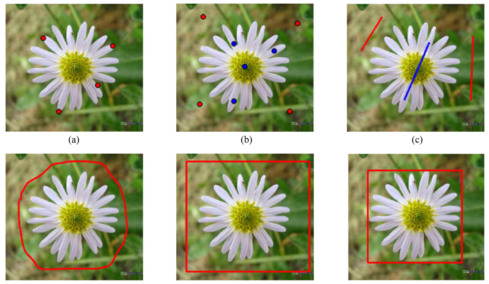

# Survey (2020)

-	Interactive Segmentation: 
	-	The task of extracting an image region or object of interest from the background using **prior knowledge** provided by user interaction.
		-	Points, scribbles, bounding box
		-	Input provides constraints on size, color, location to guide the segmentation
	-	Pros:
		-	Reduces runtime
		-	Improves quality
	-	Classify based on
		-	User interaction type
			-	Seed based - scribble, line, point
			-	ROI based - bbox, lasso
			-	Active, passive - help during inference
			-	
		-	Methodology
			-	Contour
			-	Graph Cut
			-	Random Walk
			-	Region Merging / Region Growing
			-	CNN-based
		-	Processing level
			-	Pixel-wise
			-	Superpixel-wise
			-	Hybrid
-	
