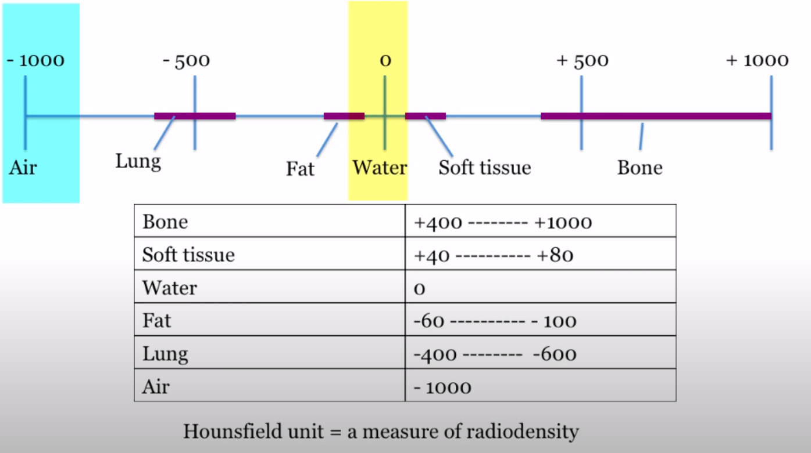

# CT (Computed Tomography)
## History
Found by Sir Godfrey Hounsfiel, Electrical Engineer. 

## Summary of Workflow
Multiple images in succession of a different layers of the body. Organs and tissues of the body attenuate the X-Rays to difference degrees. X-Rays pass through the body, are attenuated, and are detected through sensors, which quantisize them into discrete brightness values. Amount of transmitted radiation = Brightness. Specific density values correspond to brightness steps. 

**Summation of shadows**: Density of overlapping regions sum up and contribute to a higher HU value. 

**Silhouette sign**: Edges of an object are seen if interfece is with a different density (if edge of between heart and lung is fuzzy, it might indicate pneumonia).

## Comparison to X-Ray
-	In X-Rays, orthogonal views are needed to localize objects (e.g. coronal + lateral view). 
-	CT-Scans have a higher resolution, due to multiple sensors. CT can differentiate between tissues that differ in radiographic density of 1% or less.
-	CT-Scans can be projected to an arbitrary plane, creating any view of the subject.

## Density Metric
Density is measured with the Hounsfield Unit (HU). Water = 0 HU, Air = -1000 HU. The higher the HU, and hence the density, the higher the brightness in the image.

## Contrastive medium
Patients might have to administer a contrast medium to make it easier to differentiate between different kinds of tissues. It drastically increases the stomach's contrast (appears brighter). Can also be administered intravenously to contrast adjacent regions.
-	High level of iodine, absorbed by x-rays (appears white)
-	Barium Sulphate for oral contrast (small and large bowel, and stomach)

## Window levels
Change quantization of the brightness levels (JND is around 2%) so that structures with very close density levels can be contrasted.

## Radiation dose
Relatively low - average natural radiation per year.

## Application
-	Tumor detection
-	Visualize blood vessels and detect deposits
-	Pulmonary embolisms
-	Pneumonia
-	...

# PET Scans
TODO

