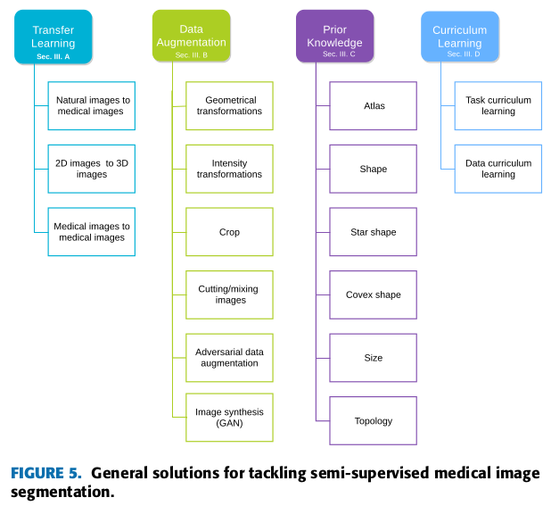

# Medical Image Segmentation With Limited Supervision: A Review of Deep Network Models

## Motivation
-	Labeling in medical settings is expensive and models need to adapt to limited training data by either a specific model design or a specific learning strategy.
-	Paper lists a lot of papers with the application domains (with references)
-	Deep and wide models require a large annotated training dataset 
	-	In order to generalize to other domains
-	Why is it hard to collect medical segmentation data?
	-	Requires expert knowledge and is time-consuming
	-	Data differences in patient populations
	-	Acquisition parameters and protocols
	-	Strict legal and ethical requirements for patient privacy
## Related Work
-	[16], [23], [24] also review segmentation methods for medical images
-	

## Overview of medical image segmentation
-	Problems:
	-	Medical images are heterogenous with imbalanced classes [17]
	-	Multiple modalities with sparse annotations
-	CNN Models (typical)
	-	U-Net, PSP-Net, DeepLab, Attention U-Net etc.

## Limited Supervision
-	Small subset of labeled training data
	-	Semi-supervised learning 
	-	However, abundance of **unlabeled images**
	-	Semi-supervised methods include
		-	Transfer learning
			-	
		-	Data augmentation
		-	Prior knowledge learning
		-	Cirruculum learning
		-	Few-shot learning
		-	Self-training
		-	Consistency regularization
		-	Co-training
		-	Self-supervised learning
		-	Adversarial learning
-	
-	Partial annotations
-	Inaccurate annotations
	-	Noisy labels, Bounding Boxes, Scribbles
-	
