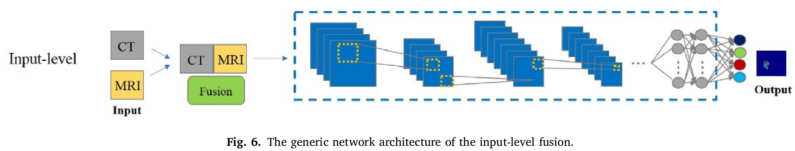
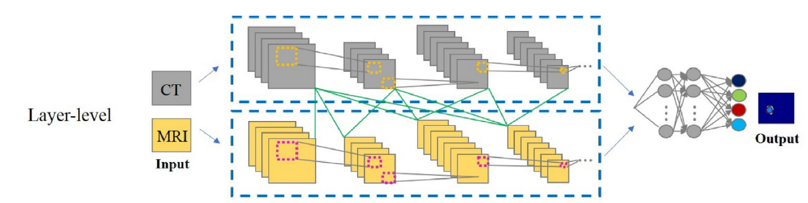
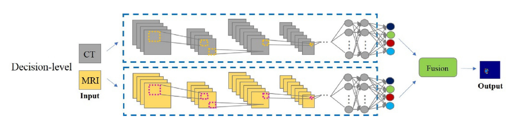

# Review of Multimodal segmentation for medical imaging (2019)

## Report
-	Early fusion is mostly used as it is simple and focuses on the subsequent segmentation architecture
	-	Does not consider the relationship between different modalities
-	Late fusion gives more attention on the fusion strategy
	-	Learns more complex relations between modalities
	-	Late fusion can be better than early fusion if the fusion method is effective enough
-	Multimodality can help reduce the information uncertainty 
	-	Multiple sources of information (lower variance in the prediction)
-	!The fusion method depends on the specific problem!

## Multimodal pipeline
-	Data preparation
	-	Data dimensions
		-	Directly use 3D volumes
			-	Expensive computational cost
			-	Computational cost can be reduced by using small random patches during training
		-	or process data slice-by-slice
			-	Ignores the spatial information along the z axis
	-	Pre-processing
		-	Image registration (modalities can be misaligned)
		-	Intensity normalization
	-	Data augmentation
		-	(Isensee, 2017) - rotations, scaling, elastic deform, gamma correction, mirroring
-	Network Architecture
	-	Basic network backbone
-	Fusion strategy-levels
	-	Input
		-	Channelwise concatenation
		-	Multi-task
			-	Separate into individual tasks (usually in a cascade)
		-	Multi-view
			-	Fuse 2D predictions of coronal, axial and sagittal views
		-	Multi-scale
			-	Apply atrous convolutions at different scales
		-	GAN-based
			-	Discriminator distinguishes between GT masks and generated segmentations
-	 
	-	Layer 
		-	Two separate inputs for two streams
			-	Streams can have some connections between each other
		-	One segmentation head
		-	DenseNets are commonly used in layer-fusion
			-	Help with vanishing gradients
			-	Regularizing effect
-	
	-	Decision
		-	Two independant networks with independant segmentations
		-	Requires much more computations and memory consumption
-	
-	Data post-processing
	-	Morphological operations
		-	Remove incorrect small fragments and keep the largest volume
		-	Simply remove connected regions smaller than a threshold
	-	CRFs

## Modalities
-	CT can diagnose muscle and bone disorders, such as bone tumors and fractures
-	MR image can offer a good soft tissue contrast  without radiation
-	PET lack anatomical characterization
	-	but can provide quantitative metabolic and functional information
-	Different views
	-	Axial, Sagittal, Coronal

## Methods
-	Guotai Wang (2018)
	-	Multi-task + Multi-view
		-	Tasks: whole tumor, bbox and enhancing of the segmentation in the end
		-	Views: softmax average of predictions for saggital, coronal and axial views
-	Autofocus Conv (2018)
	-	Quantify the contribution of each scale of multiple atrous convolutions

## Common Problems
-	Overfitting
	-	Reduce network complexity
	-	Data augmentation
-	Class imbalance
	-	Small tumors are a much smaller part of the volume
	-	Sample negative and positive samples with equal probability
		-	Works when operating on patches
	-	Weighted cross entropy
	-	Generalized Dice Loss
	-	Focal Loss

